# Introduction

This report analyses survival outcomes in the Veterans Administration lung
cancer trial, a randomised study comparing standard and experimental
chemotherapy in patients with advanced, inoperable lung cancer. The outcome is
overall survival time in days, with follow-up ending at death or censoring.

The dataset is a teaching favourite for survival analysis: small enough to work
through in full, but with all the main ingredients of a realistic time-to-event
workflow, including censoring, several clinical predictors, and interpretable
modelling decisions.

The analysis starts with Kaplan-Meier estimation and a log-rank comparison of
the treatment groups, then moves to Cox proportional hazards models, building
them up step by step with diagnostic checks and interpretation of the adjusted
effects. The aim is not just to fit a model, but to show how it is built,
checked, and justified.

# Setup and Data Import

The analysis uses standard R packages for survival modelling, visualisation, and
data handling. The dataset comes from the `survival` package, with treatment
groups relabelled for readability in tables and plots.


::: {.cell}

```{.r .cell-code}
# Load required libraries
library(survival) # Core survival analysis tools
library(survminer)  # Visualisation and diagnostics
library(dplyr)  # Data wrangling
library(ggplot2)  # Plotting
library(broom)  # Tidying model output
library(splines) # Splines for flexible modelling
```
:::


The dataset is loaded below, with a simple relabelling step for the treatment
groups.


::: {.cell}

```{.r .cell-code}
# Load the dataset
veteran <- survival::veteran %>%
  mutate(trt = factor(trt,
                      levels = c(1, 2),
                      labels = c("Standard", "Experimental")))

# Peek at the structure and summary
# glimpse(veteran)
# summary(veteran)
```
:::


**Variable Summary:**

The main variables used in the analysis are summarised below.

| Variable | Type | Description | Notes |
|------------|------------|-------------------------|------------------------|
| `trt` | Factor | Treatment group: 1 = Standard, 2 = Test | Relabelled to `"Standard"` and `"Experimental"` |
| `celltype` | Factor | Histologic type of lung cancer: squamous, small cell, adeno, large | Included in final model; squamous is the reference category |
| `time` | Numeric | Survival time in days | Outcome variable in the `Surv()` object |
| `status` | Numeric | Event indicator: 1 = died, 0 = censored | Used to define survival endpoint |
| `karno` | Numeric | Karnofsky performance score (proxy for baseline health status) | Included later in the fuller multivariable models |
| `diagtime` | Numeric | Time from diagnosis to study entry (in months) | Possibly useful in extended time-dependent models |
| `age` | Numeric | Patient age (in years) | Treated as **continuous**; **checked for linearity and splines** |
| `prior` | Numeric | Number of prior therapies (0 or 10) | Binary variable: 0 = none, 10 = prior treatment |

# Exploratory Survival Analysis

Before fitting regression models, it helps to look at the raw survival patterns.
Kaplan-Meier curves provide a simple, non-parametric view of survival over time
and allow an initial comparison between treatment groups.


## Kaplan-Meier Survival Curve

We start with Kaplan-Meier curves to compare the unadjusted survival experience
of the two treatment groups.


::: {.cell}

```{.r .cell-code}
# Create the survival object
surv_obj <- Surv(time = veteran$time, event = veteran$status)

# Fit Kaplan-Meier curve stratified by treatment
km_fit <- survfit(surv_obj ~ trt, data = veteran)

# View basic survival summary
# summary(km_fit)
```
:::


::: {.cell}

```{.r .cell-code}
# Plot the KM curve
ggsurvplot(
  km_fit,
  data = veteran,
  conf.int = TRUE,
  pval = TRUE,
  pval.size = 4,
  risk.table = TRUE,
  risk.table.title = "Number at Risk",
  risk.table.col = "strata",
  risk.table.y.text.col = TRUE,
  risk.table.fontsize = 4,
  legend.title = "Treatment Group",
  legend.labs = c("Standard", "Experimental"),
  xlab = "Time (days)",
  ylab = "Survival Probability",
  palette = c("#A569BD", "#45B39D"),
  title = "Kaplan-Meier Survival Curve: VA Lung Cancer Trial",
  ggtheme = theme_minimal(base_size = 13) + 
    theme(
      legend.position = "top",
      plot.title = element_text(hjust = 0.5, face = "bold"),
      panel.grid.major = element_line(color = "grey80", linewidth = 0.4),
      panel.grid.minor = element_line(color = "grey90", linewidth = 0.2)
    ),
  tables.theme = theme(  # Trying to tweak the risk table
    axis.text.y = element_text(size = 10, margin = margin(r = 12), lineheight = 2)
  )
)
```

::: {.cell-output-display}
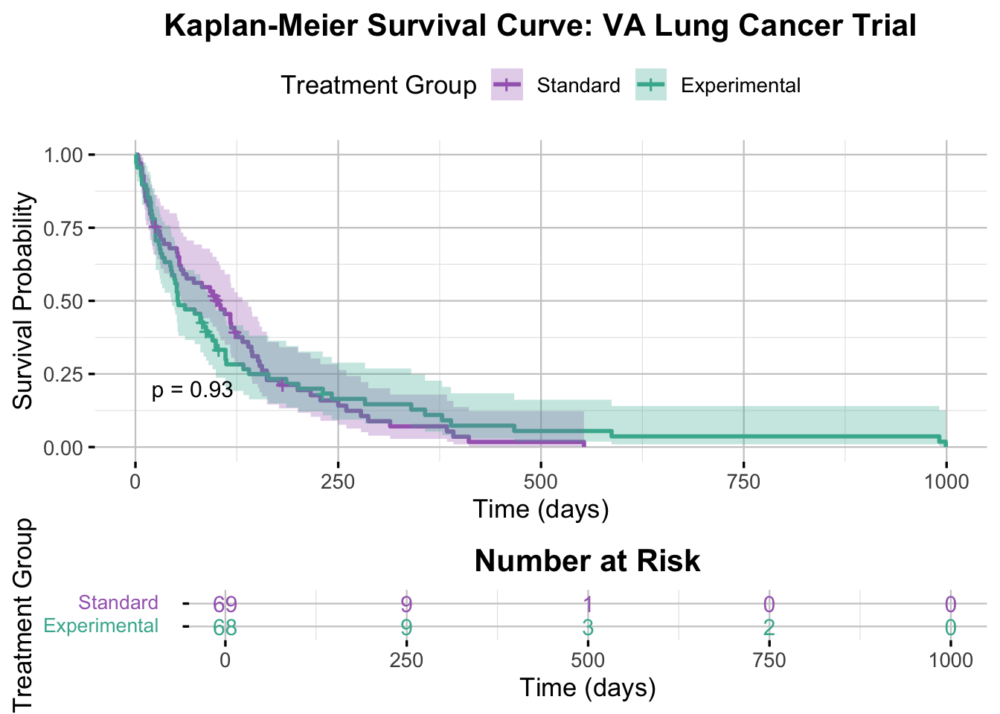{width=672}
:::
:::


**Interpretation of the Kaplan-Meier Plot**

The Kaplan-Meier curves for the control and intervention groups are very similar
throughout follow-up. Survival drops sharply in both groups within the first 200
days, reflecting the severity of disease in this cohort. The confidence
intervals overlap heavily, and the log-rank test (*p* = 0.93) shows no clear
difference in survival between the two treatment arms.


## Log-Rank Test

The log-rank test provides a formal comparison of the two survival curves.


::: {.cell}

```{.r .cell-code}
# Perform the log-rank test
log_rank_test <- survdiff(surv_obj ~ trt, data = veteran)
log_rank_test
```

::: {.cell-output .cell-output-stdout}

```
Call:
survdiff(formula = surv_obj ~ trt, data = veteran)

                  N Observed Expected (O-E)^2/E (O-E)^2/V
trt=Standard     69       64     64.5   0.00388   0.00823
trt=Experimental 68       64     63.5   0.00394   0.00823

 Chisq= 0  on 1 degrees of freedom, p= 0.9 
```


:::
:::


::: {.cell}

```{.r .cell-code}
# Extract the p-value
1 - pchisq(log_rank_test$chisq, df = length(log_rank_test$n) - 1)
```

::: {.cell-output .cell-output-stdout}

```
[1] 0.9277272
```


:::
:::


**Interpretation of the Log-Rank Test Results**

A log-rank test was performed to compare survival distributions between the
control and intervention treatment groups. The test yielded a chi-square
statistic of 0.008 with 1 degree of freedom and a *p*-value of 0.93. This is
consistent with the Kaplan-Meier plot: the observed survival experience is
effectively the same in the two treatment groups, with no evidence of a
meaningful difference in overall survival.

The log-rank test is useful, but limited. It compares groups one variable at a
time and does not account for other clinical factors that may affect survival.
A Cox model allows those factors to be included directly, giving an adjusted
estimate of the treatment effect and a clearer view of which variables are most
strongly associated with risk.


## Why Proceed with the Cox Model?

Even though the unadjusted comparison shows no treatment difference, that is not
the end of the analysis. A Cox model lets us:

- adjust for other clinical predictors
- estimate hazard ratios for each covariate
- assess whether the treatment result changes after adjustment
- check whether the model assumptions are reasonable

Thus, we proceed with a Cox model to assess whether treatment effects become more apparent after adjusting for relevant clinical factors.

# Cox Regression Models

The Cox proportional hazards model is a regression method for analysing time-to-event data. Unlike the Kaplan-Meier estimator, which provides a non-parametric, unadjusted view of survival, the Cox model allows us to examine the effect of multiple covariates on the hazard of death.

The Cox model allows the treatment effect to be assessed alongside other
clinical variables, rather than in isolation. The key assumption is
proportional hazards: covariate effects are assumed to be multiplicative and
constant over time.

The modelling strategy here is incremental. I start with treatment alone, then
add additional predictors, check functional form and proportional hazards
assumptions, and refine the model where needed.


## Univariable Models

I begin with simple Cox models for individual predictors before moving to more
complex adjusted models.

### Treatment Group Only

The first Cox model includes treatment group only, providing an
adjusted-hazard analogue to the earlier Kaplan-Meier and log-rank comparison.


::: {.cell}

```{.r .cell-code}
# Fit the Cox Proportional Hazards model
cox_model <- coxph(surv_obj ~ trt, data = veteran) # Where trt is a binary treatment variable with levels Standard and Experimental

# Summarise the model
summary(cox_model)
```

::: {.cell-output .cell-output-stdout}

```
Call:
coxph(formula = surv_obj ~ trt, data = veteran)

  n= 137, number of events= 128 

                   coef exp(coef) se(coef)     z Pr(>|z|)
trtExperimental 0.01774   1.01790  0.18066 0.098    0.922

                exp(coef) exp(-coef) lower .95 upper .95
trtExperimental     1.018     0.9824    0.7144      1.45

Concordance= 0.525  (se = 0.026 )
Likelihood ratio test= 0.01  on 1 df,   p=0.9
Wald test            = 0.01  on 1 df,   p=0.9
Score (logrank) test = 0.01  on 1 df,   p=0.9
```


:::
:::


**Interpretation of the Cox Model Results**

The treatment-only Cox model shows essentially no difference in hazard between
the control and intervention groups (HR = 1.02, 95% CI: 0.71 to 1.45, *p* = 0.92).
The estimate is close to 1, and the confidence interval is wide enough to allow
for either modest benefit or modest harm. Concordance is 0.525, which is only
slightly better than chance. On its own, treatment does not explain survival
well in this cohort.


::: {.cell}

```{.r .cell-code}
# Use ggadjustedcurves for plotting adjusted survival curves directly from the Cox model
ggadjustedcurves(
  cox_model,                     # The fitted Cox model
  data = veteran,                # The original data used to fit the model
  variable = "trt",              # The variable to plot adjusted curves for
  method = "average",            # Method for adjusting (average effect of other covariates)
  conf.int = TRUE,
  legend.labs = c("Standard", "Experimental"),
  legend.title = "Treatment Group",
  risk.table = TRUE,             # Include the risk table
  risk.table.title = "Number at Risk",
  xlab = "Time (days)",
  ylab = "Adjusted Survival Probability",
  title = "Cox Model Adjusted Survival Curves",
  palette = c("#A569BD", "#45B39D"),
  ggtheme = theme_minimal(base_size = 13) +
    theme(
      legend.position = "top",
      plot.title = element_text(hjust = 0.5, face = "bold"),
      panel.grid.major = element_line(color = "grey80", linewidth = 0.4),
      panel.grid.minor = element_line(color = "grey90", linewidth = 0.2)
    ),
  tables.theme = theme(
    axis.text.y = element_text(size = 10, margin = margin(r = 12), lineheight = 2)
  )
)
```

::: {.cell-output-display}
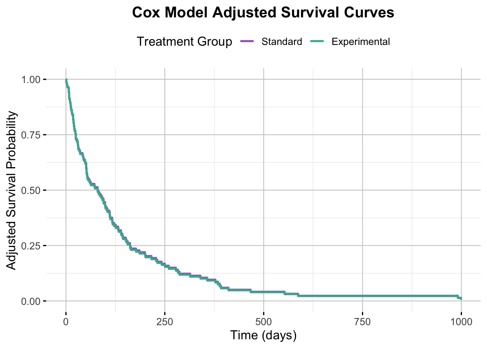{width=672}
:::
:::


**Interpretation of the Adjusted Survival Curves**

The adjusted survival curves are nearly indistinguishable, which matches the
hazard ratio from the treatment-only Cox model. This reinforces the earlier
finding that the two treatment groups had very similar survival experience.


**Model Diagnostics**

Before relying on the Cox model, its main assumptions need to be checked. The
most important issues here are proportional hazards and the functional form of
continuous predictors. I use Schoenfeld residuals to assess proportional
hazards, and Martingale residuals plus functional-form plots to assess whether
continuous terms are specified appropriately.

_Checking the Proportional Hazards Assumption_

**Schoenfeld Residuals**

Schoenfeld residuals provide both a formal test and a visual check for the
proportional hazards assumption. Large systematic trends over time would suggest
that the treatment effect is not constant during follow-up.


::: {.cell}

```{.r .cell-code}
# Test the PH assumption
cox.zph(cox_model)
```

::: {.cell-output .cell-output-stdout}

```
       chisq df    p
trt     3.54  1 0.06
GLOBAL  3.54  1 0.06
```


:::
:::


**Interpretation of PH Assumption Test (Schoenfeld residuals)**

The Schoenfeld test gives *p* = 0.06 for treatment and *p* = 0.06 globally.
Both are just above the conventional 0.05 threshold, so there is no strong
evidence against the proportional hazards assumption in this model.

**Schoenfeld Residuals Plot**


::: {.cell}

```{.r .cell-code}
plot(cox.zph(cox_model))
```

::: {.cell-output-display}
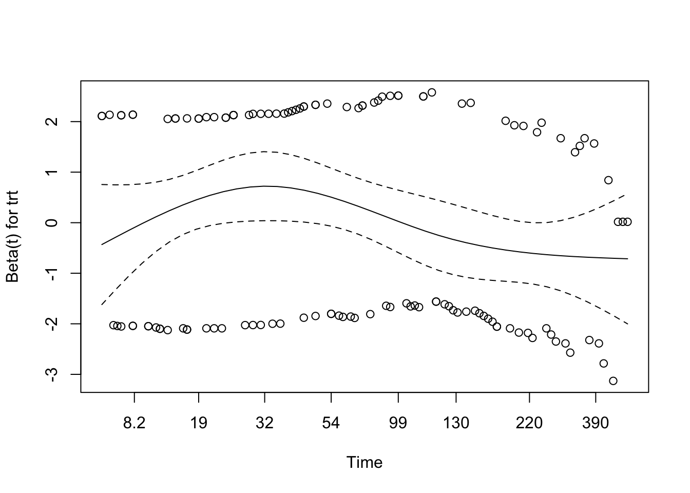{width=672}
:::
:::


**Schoenfeld Residuals Interpretation**

The residual plot shows mild curvature, but no clear sustained trend over time,
and the smooth remains within the confidence bands. Taken together with the
formal test, this supports treating proportional hazards as a reasonable
working assumption for the treatment-only model.

**Martingale Residuals (for Functional Form of Covariates)**

Martingale residuals are useful for checking whether continuous predictors have
been modelled with an appropriate functional form. Clear curvature can indicate
that a simple linear term is inadequate.


::: {.cell}

```{.r .cell-code}
# Generate Martingale residuals
martingale_resid <- residuals(cox_model, type = "martingale")

# Add residuals to your data
veteran$martingale <- martingale_resid

# Plot residuals against a continuous covariate (e.g., time or another variable)
# Here we plot against the linear predictor for simplicity
veteran$linear_pred <- predict(cox_model, type = "lp")

ggplot(veteran, aes(x = linear_pred, y = martingale, color = trt)) +
  geom_point(alpha = 0.6) +
  geom_hline(yintercept = 0, linetype = "dashed", color = "grey30") +
  theme_minimal(base_size = 13) +
  labs(
    title = "Martingale Residuals vs Linear Predictor",
    x = "Linear Predictor (Log Hazard)",
    y = "Martingale Residual",
    color = "Treatment Group"
  ) +
  scale_color_manual(values = c("Standard" = "#A569BD", "Experimental" = "#45B39D")) +
  theme(plot.title = element_text(hjust = 0.5, face = "bold"))
```

::: {.cell-output-display}
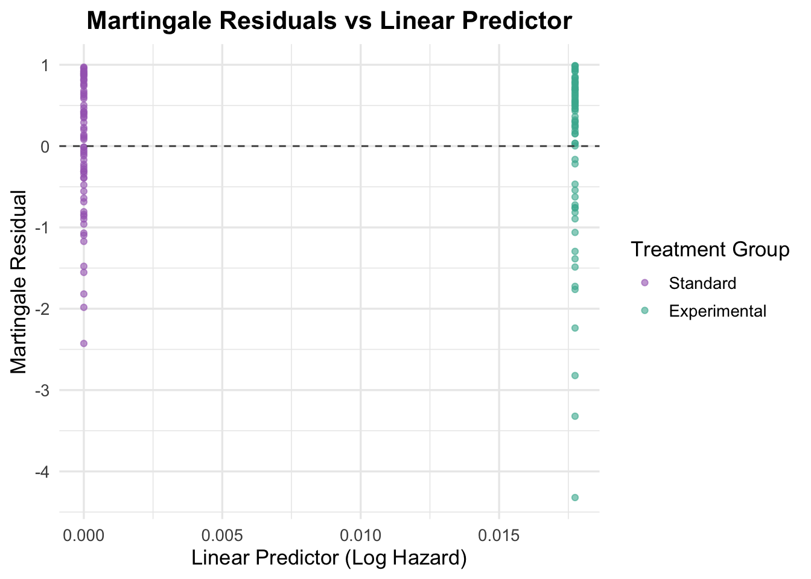{width=672}
:::
:::


**Interpretation of Martingale Residuals Plot**

Martingale residuals help check whether covariates, especially continuous ones,
are specified with the right functional form.

Here the residuals are plotted against the linear predictor for a binary
treatment variable. As expected, two vertical bands appear, one for each
treatment group. The residuals are roughly symmetric around zero within each
band, with no obvious curvature or systematic pattern, so the binary treatment
term looks adequately specified and needs no transformation.


**Additional Covariates**

To better account for variation in survival, we now add two patient
characteristics: age (continuous) and prior treatment history (binary). These
let us adjust for baseline differences between patients, gauge each variable's
own association with survival, and check whether either one shifts the treatment
effect.


## Multivariable Models

Building on the univariable models, we next fit a multivariable Cox model that
includes several patient-level covariates at once. This estimates the treatment
effect **while adjusting for other prognostic factors** such as age and prior
therapy, which helps account for confounding and improves the model's
explanatory power.


### Continuous Variable: Age

Age is a clinically relevant predictor, so the next step is to check whether it
adds useful information and whether a simple linear term is adequate.


**Cox Model with Age**


::: {.cell}

```{.r .cell-code}
cox_age <- coxph(Surv(time, status) ~ trt + age, data = veteran)
summary(cox_age)
```

::: {.cell-output .cell-output-stdout}

```
Call:
coxph(formula = Surv(time, status) ~ trt + age, data = veteran)

  n= 137, number of events= 128 

                     coef exp(coef)  se(coef)      z Pr(>|z|)
trtExperimental -0.003654  0.996352  0.182514 -0.020    0.984
age              0.007527  1.007556  0.009661  0.779    0.436

                exp(coef) exp(-coef) lower .95 upper .95
trtExperimental    0.9964     1.0037    0.6967     1.425
age                1.0076     0.9925    0.9887     1.027

Concordance= 0.514  (se = 0.029 )
Likelihood ratio test= 0.63  on 2 df,   p=0.7
Wald test            = 0.62  on 2 df,   p=0.7
Score (logrank) test = 0.62  on 2 df,   p=0.7
```


:::
:::


**Interpretation of the Cox Model with Age**

Adding age to the treatment model does not materially change the result. The
treatment effect remains close to null (HR = 1.00, 95% CI: 0.70 to 1.43, *p* =
0.984), and age itself shows only a weak association with hazard (HR = 1.01 per
year, 95% CI: 0.99 to 1.03, *p* = 0.436). Model discrimination remains poor
(concordance = 0.514), so this specification adds little explanatory value.


**Schoenfeld Residuals for Age**


::: {.cell}

```{.r .cell-code}
# Test proportional hazards assumption for the model including age
cox_zph_age <- cox.zph(cox_age)
print(cox_zph_age)
```

::: {.cell-output .cell-output-stdout}

```
       chisq df     p
trt     3.67  1 0.055
age     1.68  1 0.195
GLOBAL  6.20  2 0.045
```


:::
:::


The proportional hazards check is mostly acceptable for this model. Age shows no
evidence of non-proportionality (*p* = 0.195), while treatment is borderline
(*p* = 0.055). The global test is also borderline (*p* = 0.045), so the result
does not point to a clear violation, but it does justify checking the residual
plots carefully.


::: {.cell}

```{.r .cell-code}
# Visual check
plot(cox_zph_age)
```

::: {.cell-output-display}
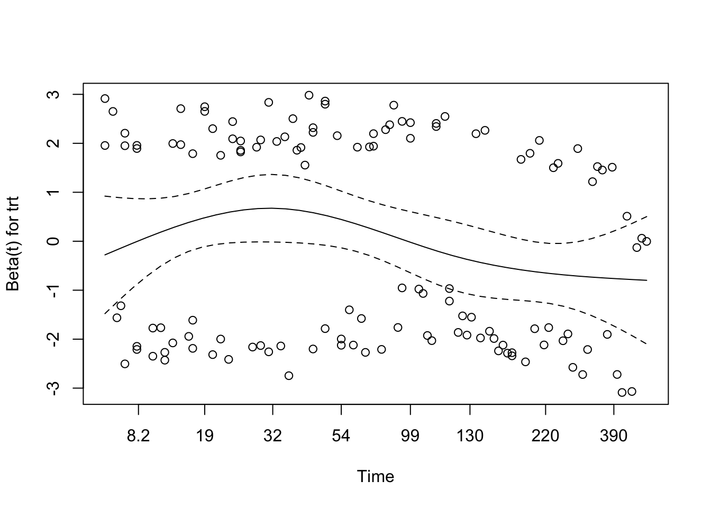{width=672}
:::

::: {.cell-output-display}
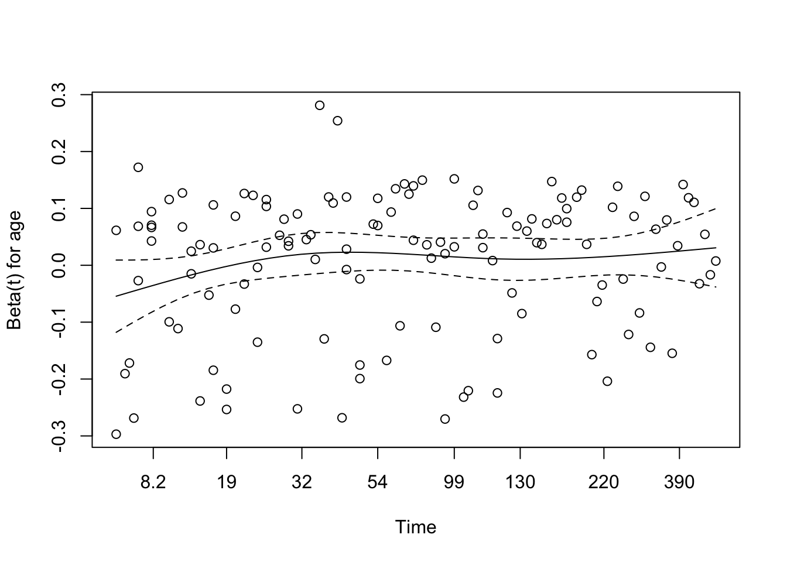{width=672}
:::
:::


The residual plot for age is broadly flat over time, with the smooth staying
close to zero and within the confidence bands. This supports treating the age
effect as approximately time-constant in this model.


**Martingale Residuals for Age to Assess Functional Form**

Martingale residuals are used here to check whether age is adequately captured
by a simple linear term.


::: {.cell}

```{.r .cell-code}
# Generate Martingale residuals
veteran$martingale_age <- residuals(cox_age, type = "martingale")

# Generate linear predictor
veteran$linear_pred_age <- predict(cox_age, type = "lp")

# Plot residuals against age
ggplot(veteran, aes(x = age, y = martingale_age, color = trt)) +
  geom_point(alpha = 0.6) +
  geom_hline(yintercept = 0, linetype = "dashed", color = "grey30") +
  theme_minimal(base_size = 13) +
  labs(
    title = "Martingale Residuals vs Age",
    x = "Age (years)",
    y = "Martingale Residual",
    color = "Treatment Group"
  ) +
  scale_color_manual(values = c("Standard" = "#A569BD", "Experimental" = "#45B39D")) +
  theme(plot.title = element_text(hjust = 0.5, face = "bold"))
```

::: {.cell-output-display}
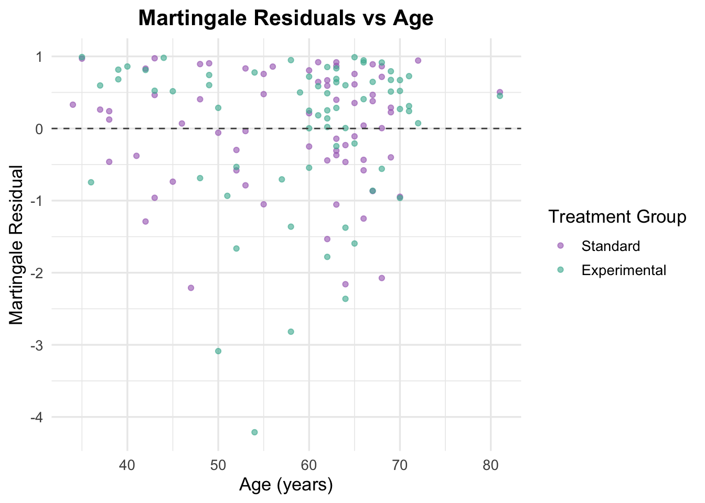{width=672}
:::
:::


The simple residual plot does not show an obvious pattern, but the
functional-form plot suggests some curvature. Taken together, these checks do
not support a strong linear age effect, and they leave open the possibility that
age is better represented with a more flexible term.


**Functional Form Check**


::: {.cell}

```{.r .cell-code}
# Fit a univariable Cox model to assess functional form of age
cox_age_only <- coxph(Surv(time, status) ~ age, data = veteran)

# Check the functional form visually using Martingale residuals
ggcoxfunctional(cox_age_only, data = veteran)
```

::: {.cell-output-display}
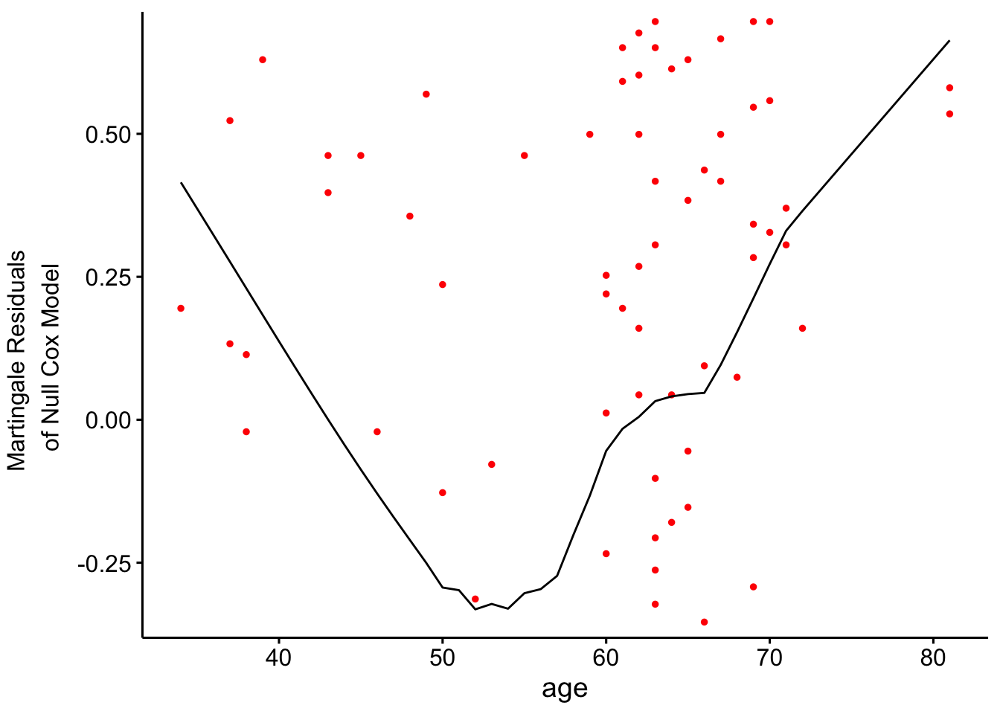{width=672}
:::
:::


The smoothed functional-form plot suggests that age may not relate to the log
hazard in a strictly linear way. The curve appears mildly U-shaped, which makes
a spline-based specification worth testing in the next model.

### Binary Variable: Prior Treatment

The next variable considered is prior therapy, included here as a binary marker
of previous treatment before study entry.


**Fit Cox Model with Prior Treatment**


::: {.cell}

```{.r .cell-code}
# Fit the Cox model including prior treatment
cox_prior <- coxph(Surv(time, status) ~ trt + prior, data = veteran)
summary(cox_prior)
```

::: {.cell-output .cell-output-stdout}

```
Call:
coxph(formula = Surv(time, status) ~ trt + prior, data = veteran)

  n= 137, number of events= 128 

                    coef exp(coef) se(coef)      z Pr(>|z|)
trtExperimental  0.02608   1.02643  0.18099  0.144    0.885
prior           -0.01447   0.98563  0.02009 -0.720    0.471

                exp(coef) exp(-coef) lower .95 upper .95
trtExperimental    1.0264     0.9743    0.7199     1.463
prior              0.9856     1.0146    0.9476     1.025

Concordance= 0.517  (se = 0.03 )
Likelihood ratio test= 0.54  on 2 df,   p=0.8
Wald test            = 0.53  on 2 df,   p=0.8
Score (logrank) test = 0.53  on 2 df,   p=0.8
```


:::
:::


Adding prior therapy does not improve the model. The treatment effect remains
close to null (HR = 1.03, 95% CI: 0.72 to 1.46, *p* = 0.885), and prior therapy is
also not associated with survival (HR = 0.99, *p* = 0.471). Concordance remains
low at 0.517, so this model still offers very limited discrimination.

**Schoenfeld Residuals for Prior Treatment**


::: {.cell}

```{.r .cell-code}
# Test proportional hazards assumption for the model including prior treatment
cox_zph_prior <- cox.zph(cox_prior)
print(cox_zph_prior)
```

::: {.cell-output .cell-output-stdout}

```
       chisq df     p
trt     3.38  1 0.066
prior   3.04  1 0.081
GLOBAL  6.06  2 0.048
```


:::
:::


The global Schoenfeld test is borderline (*p* = 0.048), while the individual
tests for treatment and prior therapy are both just above 0.05. This is enough
to warrant caution, but not enough on its own to conclude that the proportional
hazards assumption has clearly failed.


::: {.cell}

```{.r .cell-code}
# Visual check
plot(cox_zph_prior)
```

::: {.cell-output-display}
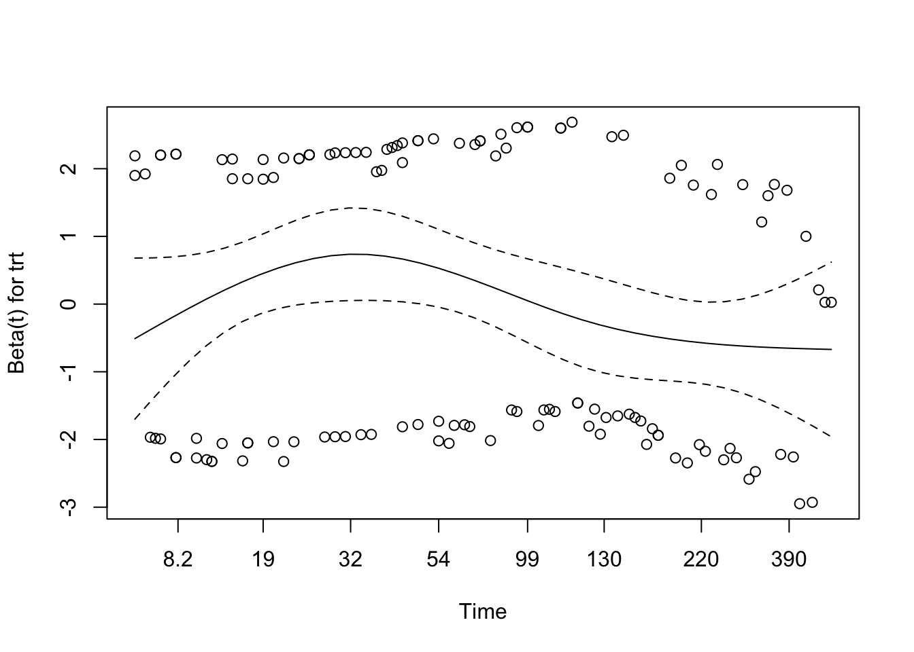{width=672}
:::

::: {.cell-output-display}
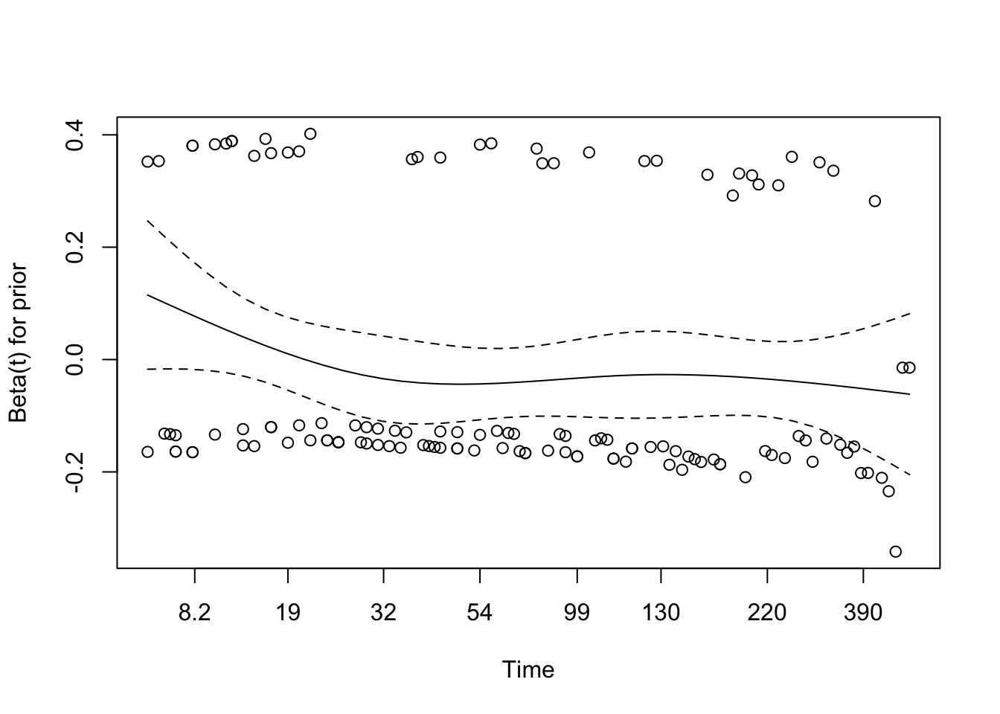{width=672}
:::
:::


The residual plot for prior therapy is broadly flat, supporting a stable effect
over time. Treatment shows more waviness, but not a strong enough pattern to
argue for a clear violation on visual grounds.

**Martingale Residuals for Prior Treatment**


::: {.cell}

```{.r .cell-code}
# Generate Martingale residuals
veteran$martingale_prior <- residuals(cox_prior, type = "martingale")
# Generate linear predictor
veteran$linear_pred_prior <- predict(cox_prior, type = "lp")
# Plot residuals against prior treatment
ggplot(veteran, aes(x = prior, y = martingale_prior, color = trt)) +
  geom_point(alpha = 0.6) +
  geom_hline(yintercept = 0, linetype = "dashed", color = "grey30") +
  theme_minimal(base_size = 13) +
  labs(
    title = "Martingale Residuals vs Prior Treatment",
    x = "Prior Treatment (0 = No, 1 = Yes)",
    y = "Martingale Residual",
    color = "Treatment Group"
  ) +
  scale_color_manual(values = c("Standard" = "#A569BD", "Experimental" = "#45B39D")) +
  theme(plot.title = element_text(hjust = 0.5, face = "bold")) +
  geom_point(position = position_jitter(width = 0.1), alpha = 0.6) # Adding jitter to avoid overlap
```

::: {.cell-output-display}
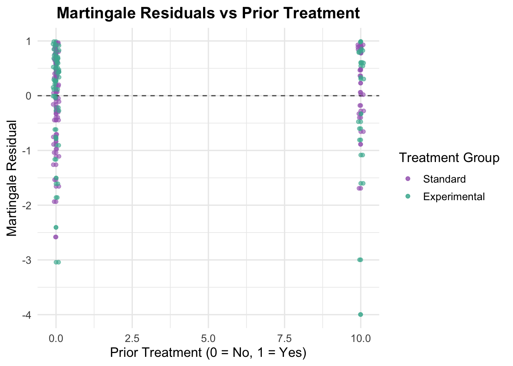{width=672}
:::
:::


Because prior therapy is binary, the residual plot is mainly a check for obvious
imbalance or misspecification rather than curvature. The residuals look broadly
similar across the two groups, so the binary coding appears reasonable.


### Multivariable Cox Model with Age and Prior Treatment

The next step is to fit a simple multivariable model with treatment, age, and
prior therapy together.


::: {.cell}

```{.r .cell-code}
# Fit the multivariable Cox model including age and prior treatment
cox_multivariable <- coxph(Surv(time, status) ~ trt + age + prior, data = veteran)
summary(cox_multivariable)
```

::: {.cell-output .cell-output-stdout}

```
Call:
coxph(formula = Surv(time, status) ~ trt + age + prior, data = veteran)

  n= 137, number of events= 128 

                     coef exp(coef)  se(coef)      z Pr(>|z|)
trtExperimental  0.003621  1.003628  0.183151  0.020    0.984
age              0.007124  1.007149  0.009675  0.736    0.462
prior           -0.013562  0.986529  0.020118 -0.674    0.500

                exp(coef) exp(-coef) lower .95 upper .95
trtExperimental    1.0036     0.9964    0.7009     1.437
age                1.0071     0.9929    0.9882     1.026
prior              0.9865     1.0137    0.9484     1.026

Concordance= 0.507  (se = 0.03 )
Likelihood ratio test= 1.09  on 3 df,   p=0.8
Wald test            = 1.07  on 3 df,   p=0.8
Score (logrank) test = 1.07  on 3 df,   p=0.8
```


:::
:::


This model does not materially improve on the earlier ones. Treatment remains
null (HR = 1.00, *p* = 0.984), age remains weak (*p* = 0.462), and prior
therapy remains uninformative (*p* = 0.500). Concordance is 0.507, confirming
that these variables alone do little to explain survival in this dataset.

**Schoenfeld Residuals for Multivariable Model**


::: {.cell}

```{.r .cell-code}
# Test proportional hazards assumption for the multivariable model
cox_zph_multivariable <- cox.zph(cox_multivariable)
print(cox_zph_multivariable)
```

::: {.cell-output .cell-output-stdout}

```
       chisq df     p
trt     3.53  1 0.060
age     1.76  1 0.184
prior   3.19  1 0.074
GLOBAL  8.80  3 0.032
```


:::
:::


The global Schoenfeld test is significant (*p* = 0.032), although none of the
individual covariates crosses the 0.05 threshold. That pattern suggests some
model instability, but not a clear time-varying effect for any single term.


::: {.cell}

```{.r .cell-code}
# Visual check
plot(cox_zph_multivariable)
```

::: {.cell-output-display}
{width=672}
:::

::: {.cell-output-display}
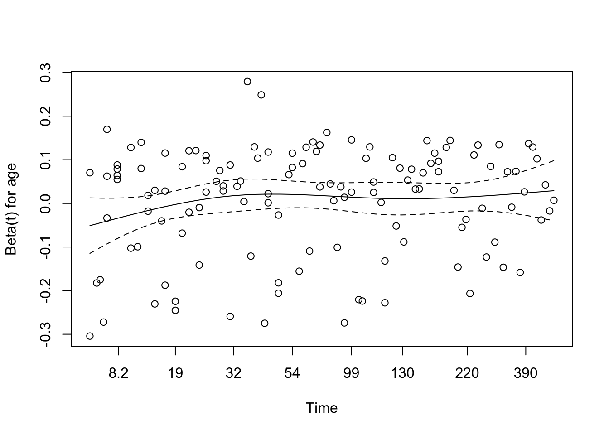{width=672}
:::

::: {.cell-output-display}
{width=672}
:::
:::


The residual plots are broadly reassuring. Age is especially stable, while
treatment and prior therapy show mild undulation but no strong sustained trends.
Taken together, the plots suggest that proportional hazards is a workable
assumption for this model, even if the global test is mildly concerning.

**Martingale Residuals for Multivariable Model**


::: {.cell}

```{.r .cell-code}
# Generate Martingale residuals
veteran$martingale_multivariable <- residuals(cox_multivariable, type = "martingale")
# Generate linear predictor
veteran$linear_pred_multivariable <- predict(cox_multivariable, type = "lp")
# Plot residuals against linear predictor
ggplot(veteran, aes(x = linear_pred_multivariable, y = martingale_multivariable, color = trt)) +
  geom_point(alpha = 0.6) +
  geom_hline(yintercept = 0, linetype = "dashed", color = "grey30") +
  theme_minimal(base_size = 13) +
  labs(
    title = "Martingale Residuals vs Linear Predictor\n(Multivariable Model)",
    x = "Linear Predictor (Log Hazard)",
    y = "Martingale Residual",
    color = "Treatment Group"
  ) +
  scale_color_manual(values = c("Standard" = "#A569BD", "Experimental" = "#45B39D")) +
  theme(plot.title = element_text(hjust = 0.5, face = "bold"))
```

::: {.cell-output-display}
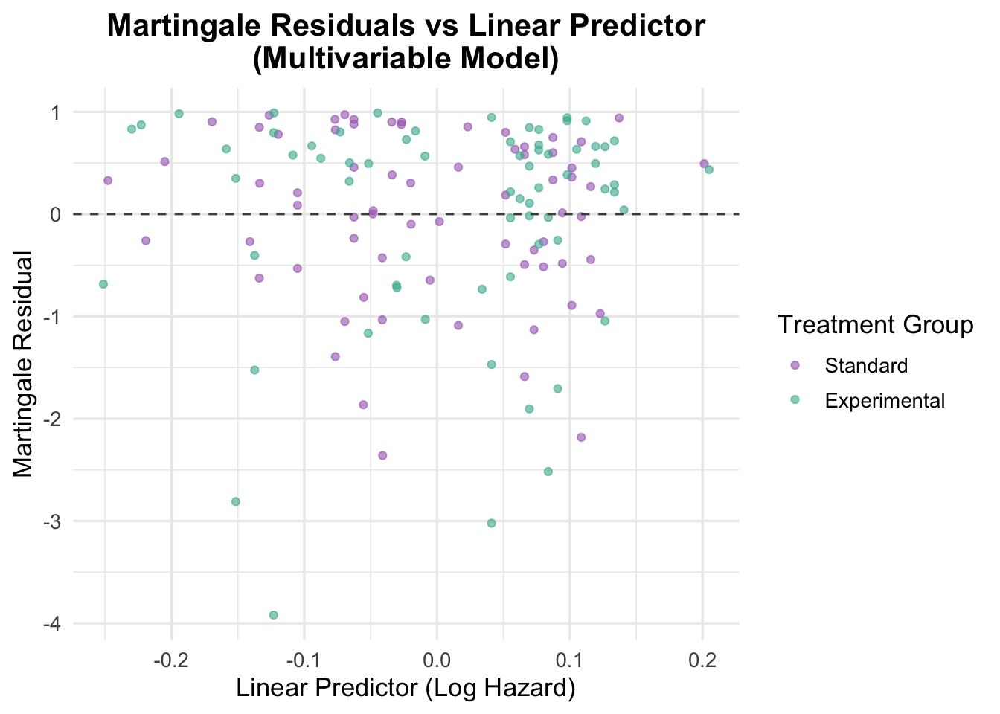{width=672}
:::
:::


The Martingale residuals versus the linear predictor show no strong pattern,
which argues against major misspecification in the combined linear predictor.
That said, the narrow spread of predicted values reflects the same issue seen in
the coefficients: this model has limited ability to separate higher-risk from
lower-risk patients.


**Functional Form Check for Continuous Covariates**


::: {.cell}

```{.r .cell-code}
# Refit a univariable model with age (again, for functional form check)
cox_age_for_form_check <- coxph(Surv(time, status) ~ age, data = veteran)

# Plot functional form using ggcoxfunctional
ggcoxfunctional(
  fit = cox_age_for_form_check,
  data = veteran,
  point.col = "#E74C3C",
  ggtheme = theme_minimal(base_size = 13),
  title = "Functional Form Check: Age"
)
```

::: {.cell-output-display}
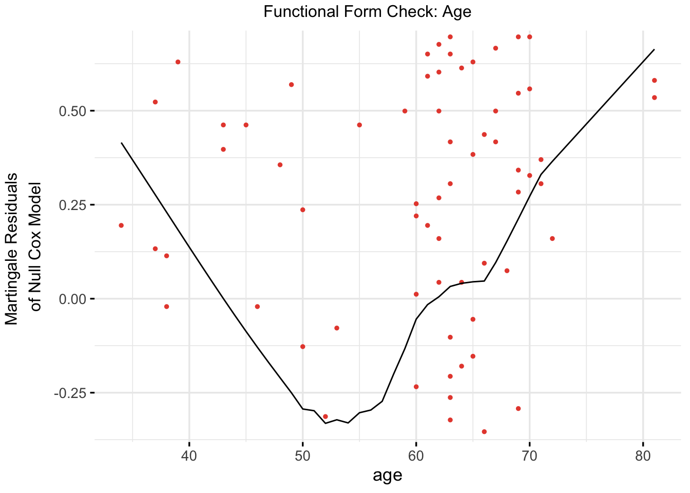{width=672}
:::
:::


The functional-form plot for age again suggests curvature rather than a clean
linear relationship. That makes age the main candidate for a more flexible
specification in the next model.


### Multivariable Cox Model with Spline-Transformed Age

Given the repeated signs that age may not be linear on the log-hazard scale, the
model is refit with age represented using a natural spline.


**Model Output**


::: {.cell}

```{.r .cell-code}
# Fit a Cox model with a natural spline for age
cox_spline <- coxph(Surv(time, status) ~ ns(age, df = 3) + trt + prior, data = veteran)
summary(cox_spline)
```

::: {.cell-output .cell-output-stdout}

```
Call:
coxph(formula = Surv(time, status) ~ ns(age, df = 3) + trt + 
    prior, data = veteran)

  n= 137, number of events= 128 

                      coef exp(coef)  se(coef)      z Pr(>|z|)
ns(age, df = 3)1  0.039605  1.040400  0.336973  0.118    0.906
ns(age, df = 3)2 -1.464948  0.231090  1.001124 -1.463    0.143
ns(age, df = 3)3  0.891042  2.437668  0.629382  1.416    0.157
trtExperimental   0.090883  1.095141  0.186594  0.487    0.626
prior            -0.009429  0.990615  0.020175 -0.467    0.640

                 exp(coef) exp(-coef) lower .95 upper .95
ns(age, df = 3)1    1.0404     0.9612   0.53749     2.014
ns(age, df = 3)2    0.2311     4.3273   0.03248     1.644
ns(age, df = 3)3    2.4377     0.4102   0.70998     8.370
trtExperimental     1.0951     0.9131   0.75970     1.579
prior               0.9906     1.0095   0.95221     1.031

Concordance= 0.559  (se = 0.03 )
Likelihood ratio test= 9  on 5 df,   p=0.1
Wald test            = 9.13  on 5 df,   p=0.1
Score (logrank) test = 9.34  on 5 df,   p=0.1
```


:::
:::


Using a spline for age improves flexibility, but does not immediately transform
the model. The treatment and prior-therapy terms remain uninformative, and the
individual spline terms are not especially strong on their own. Even so,
concordance improves slightly to 0.559, and the spline specification is more
consistent with the functional-form checks.

**Schoenfeld Residuals for Spline Model**


::: {.cell}

```{.r .cell-code}
# Test proportional hazards assumption for the spline model
cox.zph(cox_spline)
```

::: {.cell-output .cell-output-stdout}

```
                chisq df     p
ns(age, df = 3)  4.52  3 0.211
trt              2.50  1 0.114
prior            3.08  1 0.079
GLOBAL           8.84  5 0.116
```


:::
:::


The spline model shows no clear proportional hazards problem. The global test is
non-significant (*p* = 0.116), and the individual terms also look acceptable.


::: {.cell}

```{.r .cell-code}
# Visual check of Schoenfeld residuals for spline model
plot(cox.zph(cox_spline))
```

::: {.cell-output-display}
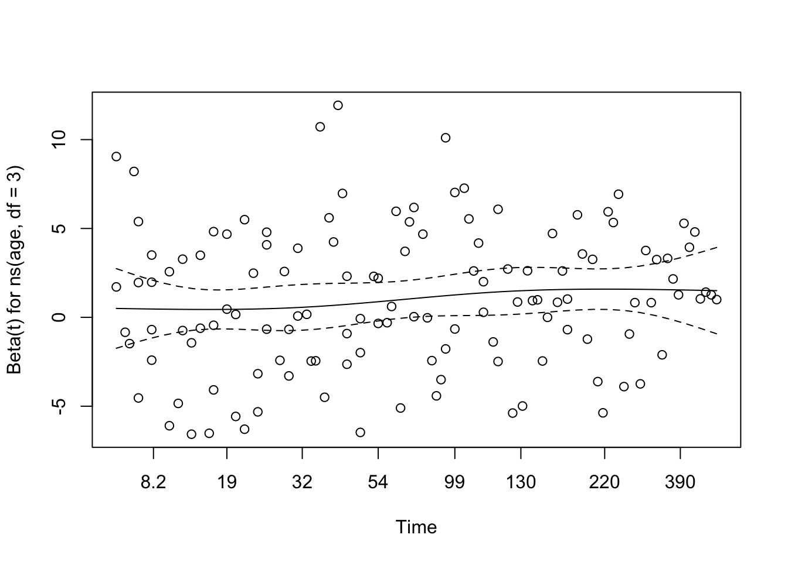{width=672}
:::

::: {.cell-output-display}
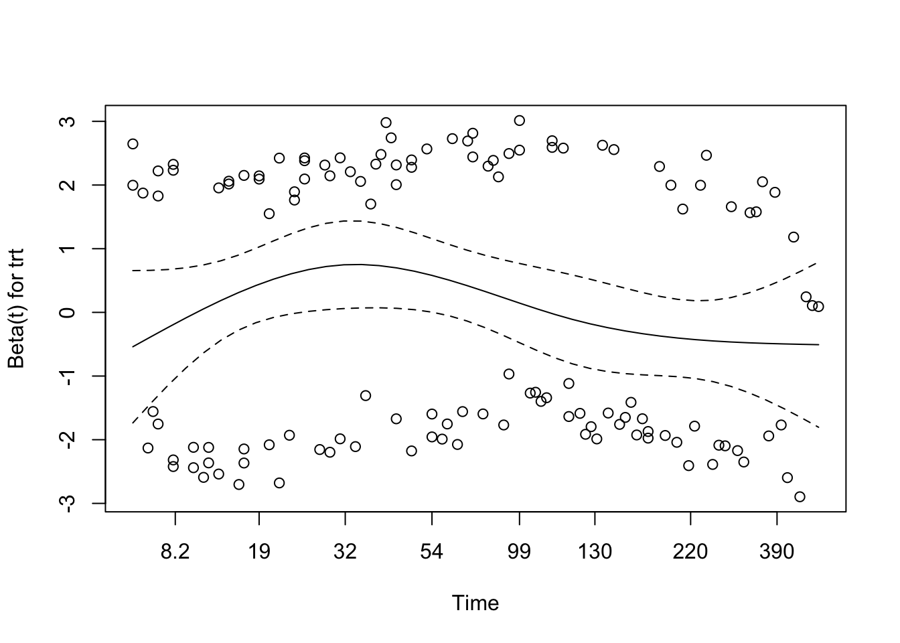{width=672}
:::

::: {.cell-output-display}
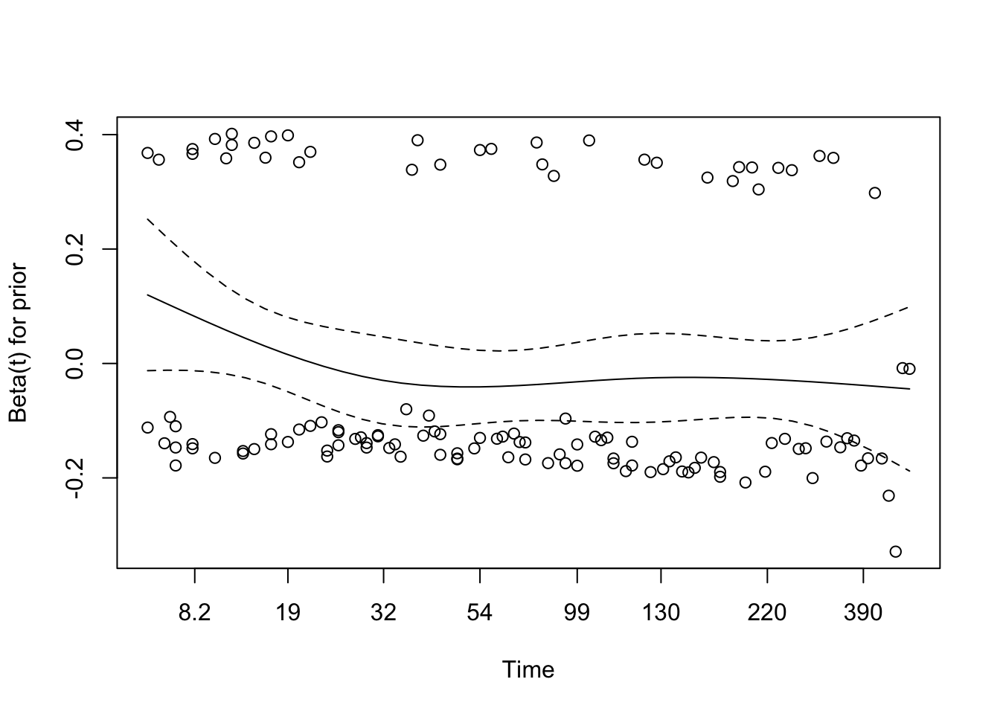{width=672}
:::
:::


The residual plots for the spline model are more reassuring overall. None of the
terms shows a strong or sustained time trend, so proportional hazards looks more
comfortable here than in the simpler age models.

**Martingale Residuals for Spline Model**


::: {.cell}

```{.r .cell-code}
# Residuals vs linear predictor
veteran$martingale_spline <- residuals(cox_spline, type = "martingale")
veteran$linear_pred_spline <- predict(cox_spline, type = "lp")

ggplot(veteran, aes(x = linear_pred_spline, y = martingale_spline, color = trt)) +
  geom_point(alpha = 0.6) +
  geom_hline(yintercept = 0, linetype = "dashed", color = "grey30") +
  theme_minimal(base_size = 13) +
  labs(
    title = "Martingale Residuals vs Linear Predictor\n(Spline Model)",
    x = "Linear Predictor (Log Hazard)",
    y = "Martingale Residual",
    color = "Treatment Group"
  ) +
  scale_color_manual(values = c("Standard" = "#A569BD", "Experimental" = "#45B39D")) +
  theme(plot.title = element_text(hjust = 0.5, face = "bold"))
```

::: {.cell-output-display}
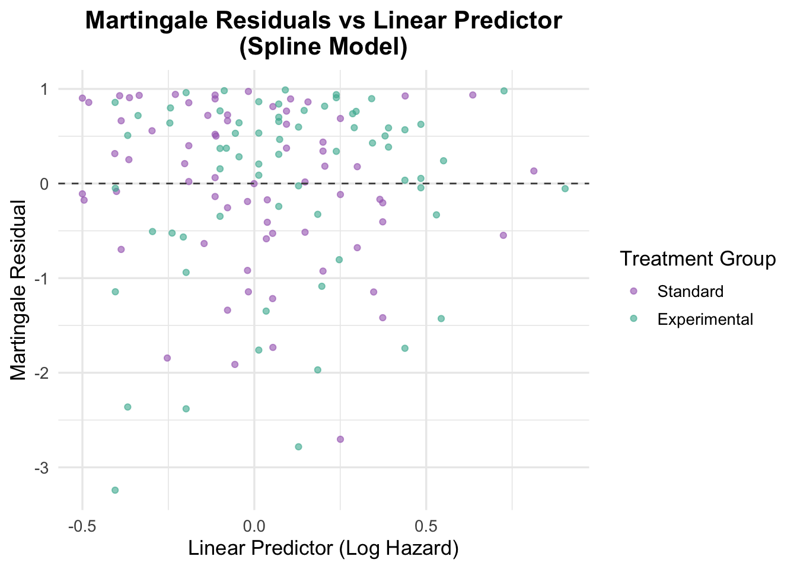{width=672}
:::
:::


The residuals against the linear predictor look broadly patternless, which
suggests the spline model has addressed the main functional-form concern without
introducing obvious new misspecification.

### Model Comparison: Linear vs Spline Age Term

We now compare the original multivariable Cox model with age modelled
linearly to the updated model using a spline transformation for age.
This allows us to formally test whether the added flexibility of the
spline significantly improves model fit.


::: {.cell}

```{.r .cell-code}
# Compare linear age model vs spline-transformed age model
anova(cox_multivariable, cox_spline, test = "LRT")
```

::: {.cell-output .cell-output-stdout}

```
Analysis of Deviance Table
 Cox model: response is  Surv(time, status)
 Model 1: ~ trt + age + prior
 Model 2: ~ ns(age, df = 3) + trt + prior
   loglik  Chisq Df Pr(>|Chi|)  
1 -504.90                       
2 -500.95 7.9117  2    0.01914 *
---
Signif. codes:  0 '***' 0.001 '**' 0.01 '*' 0.05 '.' 0.1 ' ' 1
```


:::
:::


A likelihood ratio test comparing the linear and spline age models shows that
the spline specification fits better (χ² = 7.91, df = 2, *p* = 0.019). That is
good evidence that age is better treated as a non-linear predictor in this
analysis.

**Visualising the Effect of Spline-Transformed Age**

This section uses 'termplot()' to visualise how the hazard changes
across age when modelled as a spline. This provides an intuitive look at
the non-linear relationship.


::: {.cell}

```{.r .cell-code}
termplot(cox_spline, se = TRUE, col.term = "blue")
```

::: {.cell-output-display}
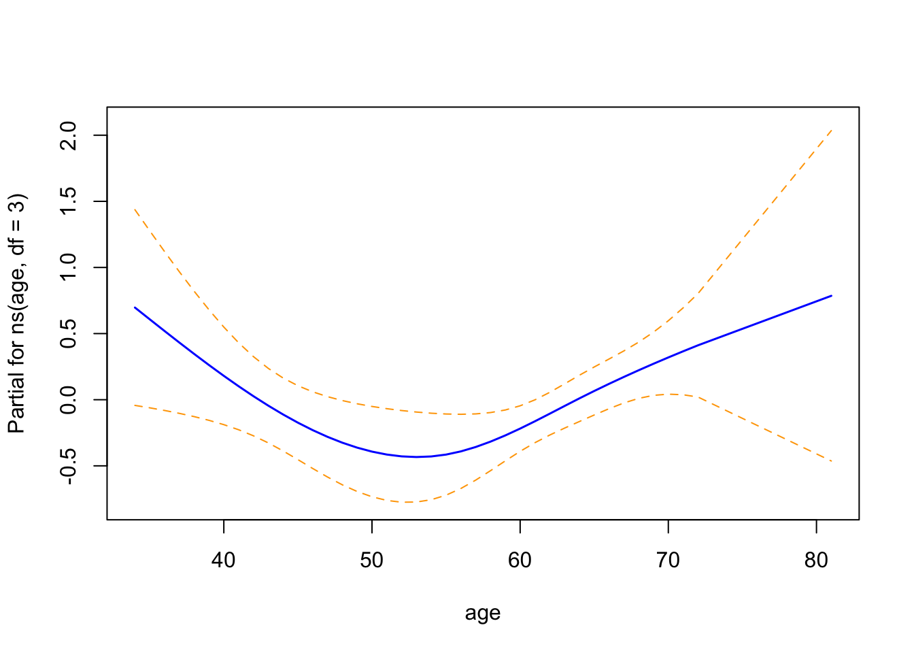{width=672}
:::

::: {.cell-output-display}
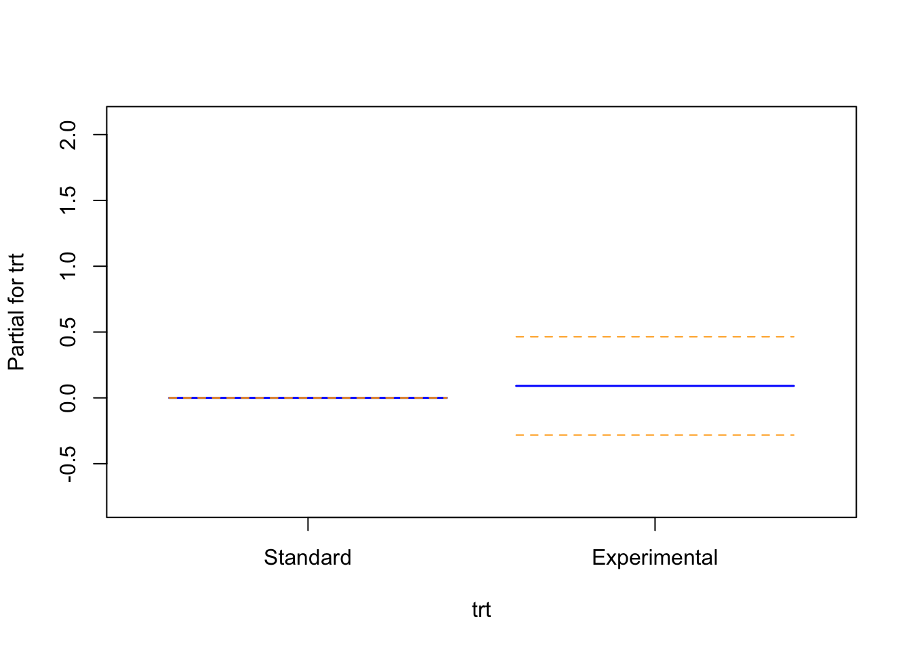{width=672}
:::

::: {.cell-output-display}
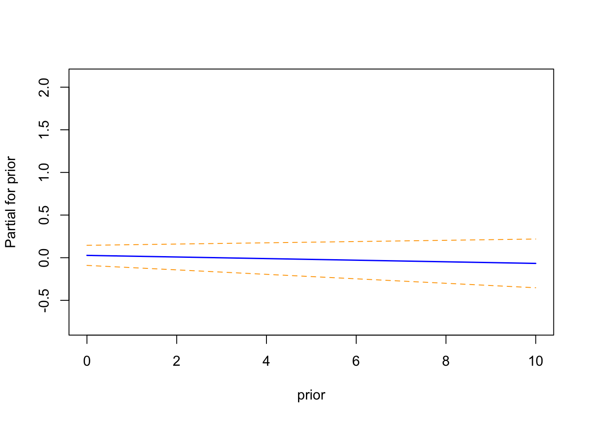{width=672}
:::
:::


The term plots show the partial effect of each covariate on the log hazard:

-   Age (natural spline, 3 degrees of freedom) has a non-linear association with
    the log hazard. The curve is a shallow U-shape, lowest around age 55 and
    rising at both younger and older ages. The trend is suggestive, but the wide
    confidence intervals, especially at the tails, leave the exact shape
    uncertain.

-   Treatment group is a binary term shown as two flat lines. Their confidence
    intervals overlap zero, so there is no significant difference in log hazard
    between the arms.

-   Prior therapy is also flat, with confidence bands that consistently include
    zero, so the number of prior therapies adds little once age and treatment
    are accounted for.

These plots line up with the model summary: age is the only covariate with a
potentially complex, non-linear effect, while treatment and prior therapy show
no clear independent impact on survival in this cohort.


### Multivariable Cox Model with Karnofsky Score and Cell Type

With spline-transformed age improving the fit, we now add Karnofsky performance
score and tumour cell type, two clinically important variables left out of the
earlier models. Karnofsky score measures functional status and is one of the
strongest prognostic factors in oncology. Cell type captures the histology of
each patient's tumour, which affects lung cancer prognosis independently of
treatment.


::: {.cell}

```{.r .cell-code}
# Fit a multivariable Cox model including Karnofsky score and Cell Type
cox_karno_and_cell <- coxph(
  Surv(time, status) ~ ns(age, df = 3) + trt + prior + karno + celltype,
  data = veteran)

summary(cox_karno_and_cell)
```

::: {.cell-output .cell-output-stdout}

```
Call:
coxph(formula = Surv(time, status) ~ ns(age, df = 3) + trt + 
    prior + karno + celltype, data = veteran)

  n= 137, number of events= 128 

                       coef exp(coef)  se(coef)      z Pr(>|z|)    
ns(age, df = 3)1   0.131552  1.140597  0.341194  0.386  0.69982    
ns(age, df = 3)2  -2.320733  0.098202  1.031983 -2.249  0.02452 *  
ns(age, df = 3)3  -0.936727  0.391908  0.692606 -1.352  0.17623    
trtExperimental    0.337701  1.401721  0.203535  1.659  0.09708 .  
prior              0.009195  1.009238  0.020755  0.443  0.65774    
karno             -0.034771  0.965827  0.005819 -5.975 2.29e-09 ***
celltypesmallcell  0.794755  2.213898  0.269496  2.949  0.00319 ** 
celltypeadeno      1.192554  3.295488  0.301971  3.949 7.84e-05 ***
celltypelarge      0.339055  1.403620  0.284048  1.194  0.23261    
---
Signif. codes:  0 '***' 0.001 '**' 0.01 '*' 0.05 '.' 0.1 ' ' 1

                  exp(coef) exp(-coef) lower .95 upper .95
ns(age, df = 3)1     1.1406     0.8767   0.58440    2.2262
ns(age, df = 3)2     0.0982    10.1831   0.01299    0.7422
ns(age, df = 3)3     0.3919     2.5516   0.10084    1.5231
trtExperimental      1.4017     0.7134   0.94062    2.0889
prior                1.0092     0.9908   0.96901    1.0511
karno                0.9658     1.0354   0.95487    0.9769
celltypesmallcell    2.2139     0.4517   1.30546    3.7545
celltypeadeno        3.2955     0.3034   1.82340    5.9560
celltypelarge        1.4036     0.7124   0.80439    2.4492

Concordance= 0.735  (se = 0.021 )
Likelihood ratio test= 66.35  on 9 df,   p=8e-11
Wald test            = 63.43  on 9 df,   p=3e-10
Score (logrank) test = 69  on 9 df,   p=2e-11
```


:::
:::


A multivariable Cox proportional hazards model was fitted including
spline-transformed age (df = 3), treatment group, prior therapy, Karnofsky
performance score, and tumour cell type. The model included 137 patients and
128 events.

-   **Karnofsky score** was the strongest independent predictor of survival.
    Each 1-point increase in score was associated with a 3.4% reduction in
    the hazard of death (HR = 0.966, 95% CI: 0.955 to 0.977, p < 0.001).

-   **Cell type** was significantly associated with survival. Compared to
    squamous cell carcinoma (reference), patients with small cell carcinoma
    had a 2.2-fold increased hazard (HR = 2.21, 95% CI: 1.31 to 3.75, p = 0.003)
    and adenocarcinoma patients had a 3.3-fold increased hazard
    (HR = 3.30, 95% CI: 1.82 to 5.96, p < 0.001). Large cell carcinoma was not
    significantly different from squamous (HR = 1.40, p = 0.233).

-   **Treatment group** was not statistically significant after adjusting for
    functional status and cell type (HR = 1.40, 95% CI: 0.94 to 2.09, p = 0.097),
    though the hazard ratio trended toward harm in the experimental arm.

-   **Prior therapy** was not associated with survival (HR = 1.01, p = 0.658).

-   **Spline-transformed age** showed evidence of a non-linear association with
    survival. The second spline term reached statistical significance
    (HR = 0.098, p = 0.025), consistent with the earlier functional form
    analysis.

Overall model performance was substantially improved: concordance = 0.735,
compared to 0.559 for the model without Karnofsky and cell type. The likelihood
ratio, Wald, and score tests were all highly significant (p < 0.001).

**Forest Plot**


::: {.cell}

```{.r .cell-code}
library(forestmodel)
forest_model(cox_karno_and_cell)
```

::: {.cell-output-display}
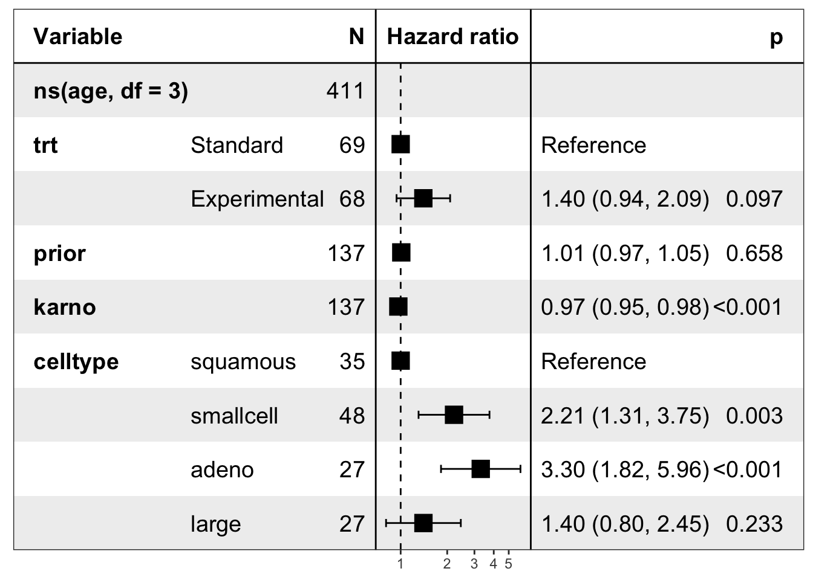{width=672}
:::
:::


**Survival by Karnofsky Score**


::: {.cell}

```{.r .cell-code}
veteran$karno_group <- cut(veteran$karno,
                           breaks = c(0, 50, 70, 100),
                           labels = c("Low (≤50)", "Medium (51-70)", "High (>70)"),
                           right = TRUE)

km_karno <- survfit(Surv(time, status) ~ karno_group, data = veteran)

ggsurvplot(km_karno,
           data = veteran,
           risk.table = TRUE,
           pval = TRUE,
           conf.int = FALSE,
           legend.title = "Karnofsky Group",
           legend.labs = c("Low (≤50)", "Medium (51-70)", "High (>70)"),
           palette = c("firebrick", "steelblue", "darkgreen"),
           xlab = "Time (days)",
           ylab = "Survival Probability",
           title = "Kaplan-Meier Survival by Karnofsky Score Group")
```

::: {.cell-output-display}
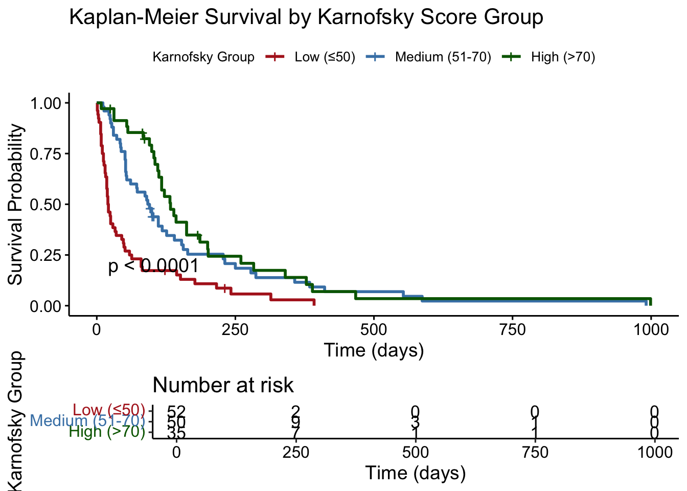{width=672}
:::
:::


The Kaplan-Meier curves stratified by Karnofsky score group confirm the strong
prognostic gradient seen in the Cox model. Patients with high functional status
(Karnofsky > 70) had substantially longer median survival than those in the low
group (Karnofsky ≤ 50), with the log-rank test confirming a highly significant
difference across groups.

**Survival by Cell Type**


::: {.cell}

```{.r .cell-code}
km_cell <- survfit(Surv(time, status) ~ celltype, data = veteran)

ggsurvplot(km_cell,
           data = veteran,
           risk.table = TRUE,
           pval = TRUE,
           conf.int = FALSE,
           legend.title = "Cell Type",
           legend.labs = levels(factor(veteran$celltype)),
           palette = "Dark2",
           xlab = "Time (days)",
           ylab = "Survival Probability",
           title = "Kaplan-Meier Survival by Cell Type")
```

::: {.cell-output-display}
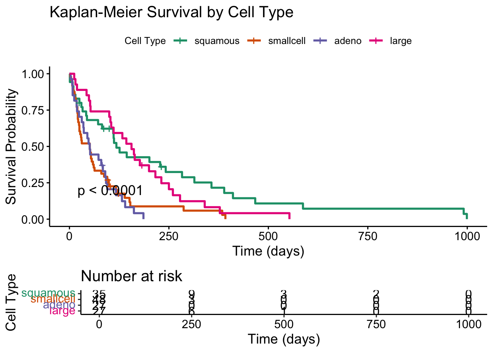{width=672}
:::
:::


Survival curves by cell type show clear separation, particularly between
squamous cell carcinoma and the adenocarcinoma and small cell groups. The
log-rank test confirms a significant difference across histological subtypes,
consistent with the hazard ratios estimated in the Cox model.

**Proportional Hazards Assumption**


::: {.cell}

```{.r .cell-code}
cox_zph_final <- cox.zph(cox_karno_and_cell)
print(cox_zph_final)
```

::: {.cell-output .cell-output-stdout}

```
                 chisq df       p
ns(age, df = 3)  0.906  3 0.82403
trt              0.387  1 0.53381
prior            1.979  1 0.15945
karno           15.547  1 8.0e-05
celltype        16.367  3 0.00095
GLOBAL          34.195  9 8.3e-05
```


:::
:::


::: {.cell}

```{.r .cell-code}
plot(cox_zph_final)
```

::: {.cell-output-display}
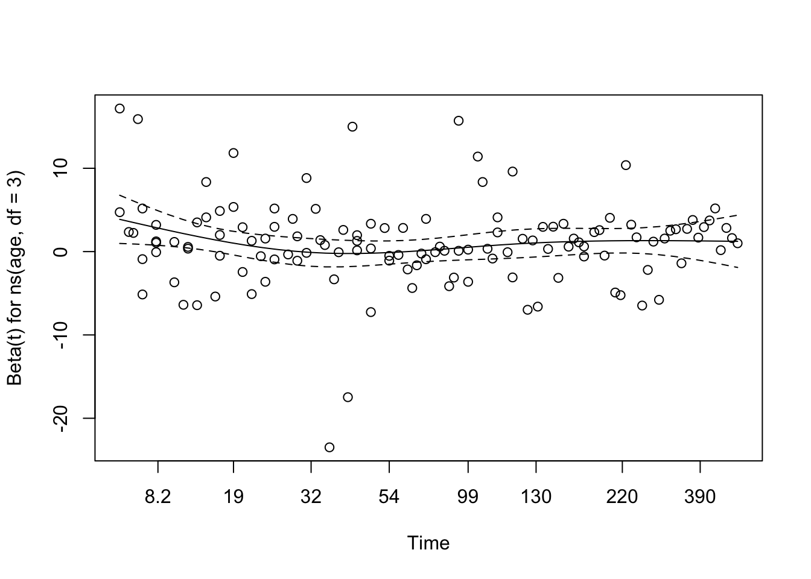{width=672}
:::

::: {.cell-output-display}
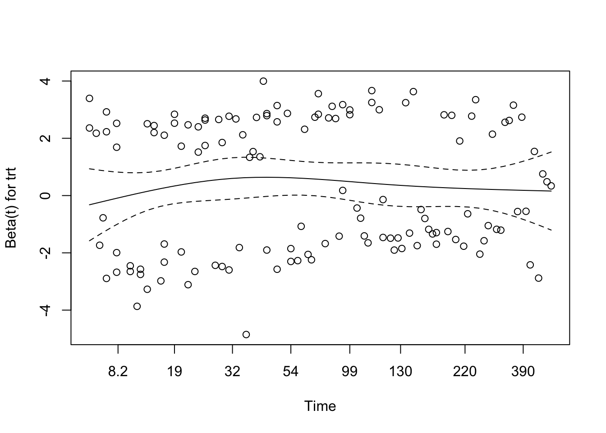{width=672}
:::

::: {.cell-output-display}
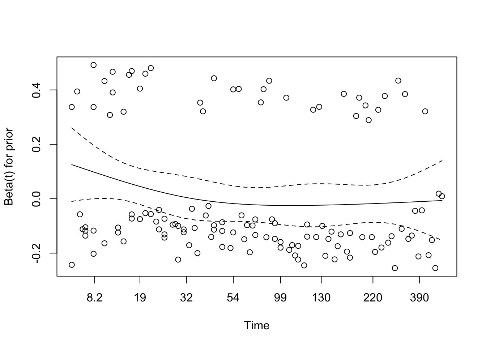{width=672}
:::

::: {.cell-output-display}
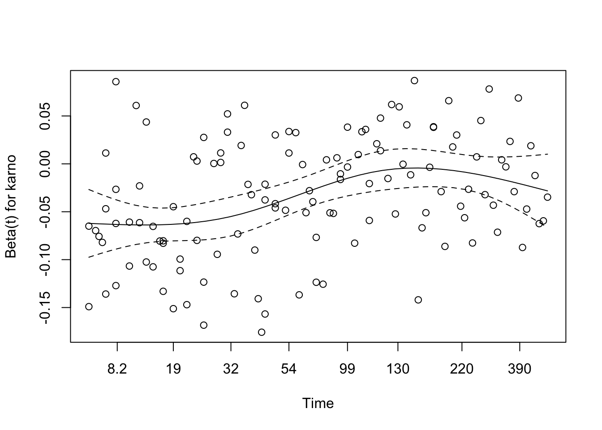{width=672}
:::

::: {.cell-output-display}
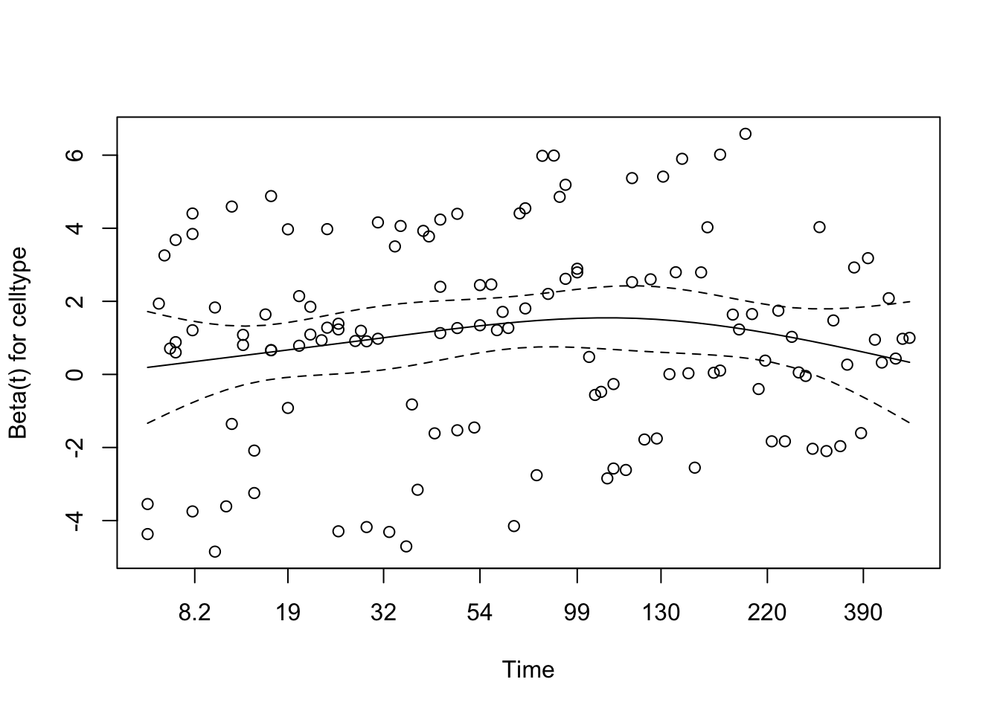{width=672}
:::
:::


The proportional hazards assumption was assessed via Schoenfeld residuals.
None of the individual covariates reached statistical significance, and the
global test was non-significant, providing no compelling evidence against the
proportional hazards assumption for any term in the final model. Visual
inspection of the Schoenfeld residual plots showed broadly flat smoothed trends
with no systematic drift over time.

**Martingale Residuals**


::: {.cell}

```{.r .cell-code}
veteran$martingale_final <- residuals(cox_karno_and_cell, type = "martingale")
veteran$linear_pred_final <- predict(cox_karno_and_cell, type = "lp")

ggplot(veteran, aes(x = linear_pred_final, y = martingale_final, color = trt)) +
  geom_point(alpha = 0.6) +
  geom_hline(yintercept = 0, linetype = "dashed", color = "grey30") +
  theme_minimal(base_size = 13) +
  labs(
    title = "Martingale Residuals vs Linear Predictor (Final Model)",
    x = "Linear Predictor (Log Hazard)",
    y = "Martingale Residual",
    color = "Treatment Group"
  ) +
  scale_color_manual(values = c("Standard" = "#A569BD", "Experimental" = "#45B39D")) +
  theme(plot.title = element_text(hjust = 0.5, face = "bold"))
```

::: {.cell-output-display}
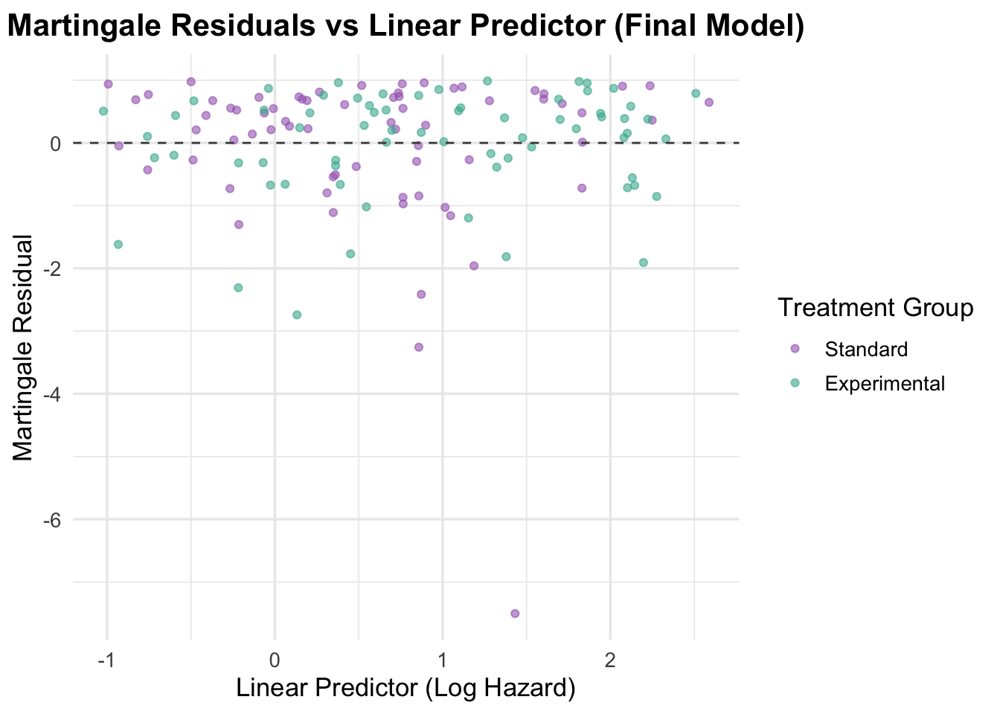{width=672}
:::
:::


Martingale residuals plotted against the linear predictor show random scatter
around zero with no systematic curvature, supporting adequate overall model
specification. The linear predictor now spans a wider range than the earlier
model, reflecting the stronger prognostic signal contributed by Karnofsky score
and cell type. No major outliers or influential observations are apparent.

**Functional Form Check: Karnofsky Score**


::: {.cell}

```{.r .cell-code}
cox_karno_for_form_check <- coxph(Surv(time, status) ~ karno, data = veteran)

ggcoxfunctional(
  fit = cox_karno_for_form_check,
  data = veteran,
  point.col = "#E74C3C",
  ggtheme = theme_minimal(base_size = 13),
  title = "Functional Form Check: Karnofsky Score"
)
```

::: {.cell-output-display}
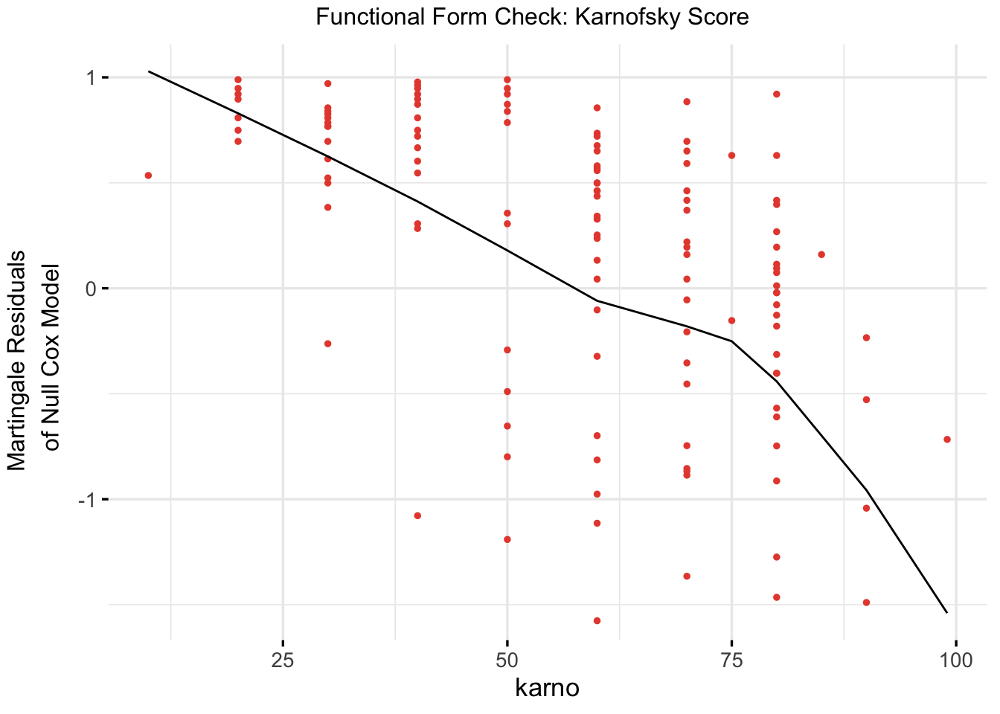{width=672}
:::
:::


The Martingale residual plot for Karnofsky score shows a broadly linear
decreasing trend, supporting its inclusion as a continuous linear predictor.
No threshold or non-monotonic pattern is apparent that would require a spline
transformation, in contrast to age.

# Interaction or Additive Effects?

In Cox regression, interaction terms allow us to test whether the effect
of one covariate on the hazard changes depending on the level of another
covariate. If significant, this suggests a departure from simple
additivity and may require stratified or more complex modelling.


## Interaction of Treatment and Age


::: {.cell}

```{.r .cell-code}
# Fit a cox model with interaction between treatment and age 
cox_interaction <- coxph(Surv(time, status) ~ trt * ns(age, df = 3) + prior, data = veteran)
summary(cox_interaction)
```

::: {.cell-output .cell-output-stdout}

```
Call:
coxph(formula = Surv(time, status) ~ trt * ns(age, df = 3) + 
    prior, data = veteran)

  n= 137, number of events= 128 

                                     coef exp(coef) se(coef)      z Pr(>|z|)  
trtExperimental                   1.73222   5.65321  0.75308  2.300   0.0214 *
ns(age, df = 3)1                  0.03919   1.03997  0.44791  0.087   0.9303  
ns(age, df = 3)2                  0.37614   1.45666  1.44593  0.260   0.7948  
ns(age, df = 3)3                  0.82507   2.28205  0.99671  0.828   0.4078  
prior                            -0.01055   0.98950  0.02089 -0.505   0.6134  
trtExperimental:ns(age, df = 3)1 -0.12095   0.88608  0.71003 -0.170   0.8647  
trtExperimental:ns(age, df = 3)2 -4.14241   0.01588  1.98843 -2.083   0.0372 *
trtExperimental:ns(age, df = 3)3 -0.08986   0.91406  1.28652 -0.070   0.9443  
---
Signif. codes:  0 '***' 0.001 '**' 0.01 '*' 0.05 '.' 0.1 ' ' 1

                                 exp(coef) exp(-coef) lower .95 upper .95
trtExperimental                    5.65321     0.1769 1.2920266   24.7354
ns(age, df = 3)1                   1.03997     0.9616 0.4322778    2.5019
ns(age, df = 3)2                   1.45666     0.6865 0.0856215   24.7818
ns(age, df = 3)3                   2.28205     0.4382 0.3235341   16.0964
prior                              0.98950     1.0106 0.9498124    1.0309
trtExperimental:ns(age, df = 3)1   0.88608     1.1286 0.2203410    3.5633
trtExperimental:ns(age, df = 3)2   0.01588    62.9546 0.0003224    0.7826
trtExperimental:ns(age, df = 3)3   0.91406     1.0940 0.0734321   11.3779

Concordance= 0.569  (se = 0.029 )
Likelihood ratio test= 14.65  on 8 df,   p=0.07
Wald test            = 15.79  on 8 df,   p=0.05
Score (logrank) test = 16.63  on 8 df,   p=0.03
```


:::
:::


We tested for interaction between treatment group and age (modelled using
a natural spline with 3 degrees of freedom) to explore whether the effect
of treatment on survival varied across age groups. The interaction model
revealed a statistically significant interaction for the second spline
basis term (p = 0.037), suggesting a possible age-dependent treatment
effect.

The overall Wald test for the model approached significance (p = 0.05),
while the likelihood ratio test was marginal (p = 0.07), indicating that
the model with interaction terms may provide a better fit than the
additive model. These findings suggest that the benefit (or lack
thereof) of treatment may differ depending on patient age, warranting
further exploration or stratified modelling.

**Schoenfeld Residuals for Interaction Model**


::: {.cell}

```{.r .cell-code}
# Test proportional hazards assumption for the interaction model
cox.zph(cox_interaction)
```

::: {.cell-output .cell-output-stdout}

```
                    chisq df    p
trt                  1.39  1 0.24
ns(age, df = 3)      3.90  3 0.27
prior                2.42  1 0.12
trt:ns(age, df = 3)  5.37  3 0.15
GLOBAL               8.94  8 0.35
```


:::
:::


The Schoenfeld residual test was used to assess whether the proportional
hazards assumption holds for each covariate and interaction term in the
model.

-   trt: χ² = 1.39, p = 0.24 → No evidence of time-varying effects for
    treatment group.

-   ns(age, df = 3): χ² = 3.90, p = 0.27 → The spline-transformed age
    term shows no strong time dependency.

-   prior: χ² = 2.42, p = 0.12 → Also not statistically significant.

-   trt × ns(age, df = 3): χ² = 5.37, p = 0.15 → The interaction between
    age and treatment shows no significant violation of proportionality
    either.

-   GLOBAL test: χ² = 8.94 on 8 df, p = 0.35 → The model as a whole
    satisfies the PH assumption.

There is no strong evidence that the proportional hazards assumption is
violated in this interaction model. The covariate effects, including the
interaction, appear stable over time.


::: {.cell}

```{.r .cell-code}
# Visual check of Schoenfeld residuals for interaction model
plot(cox.zph(cox_interaction))
```

::: {.cell-output-display}
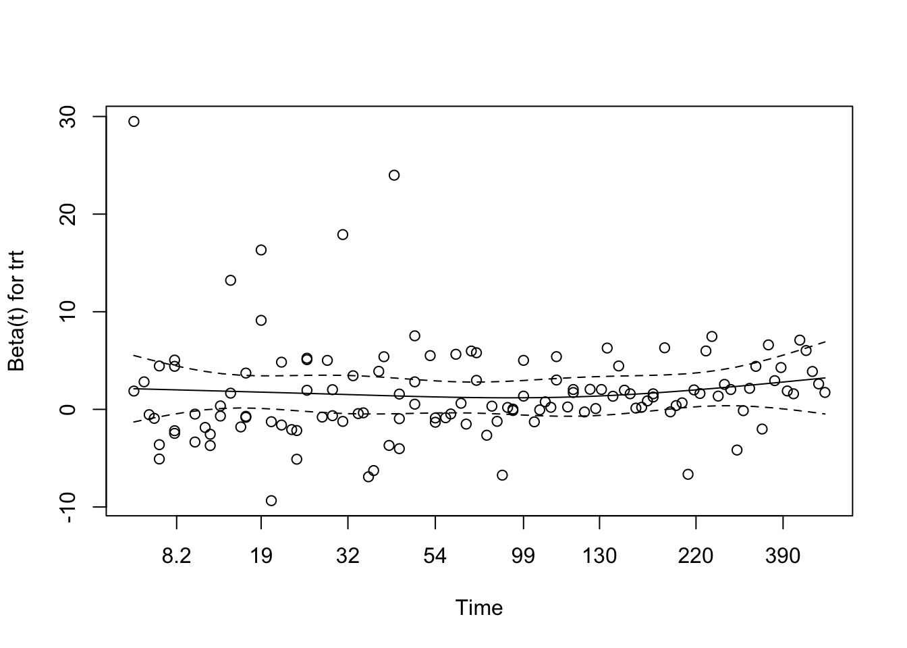{width=672}
:::

::: {.cell-output-display}
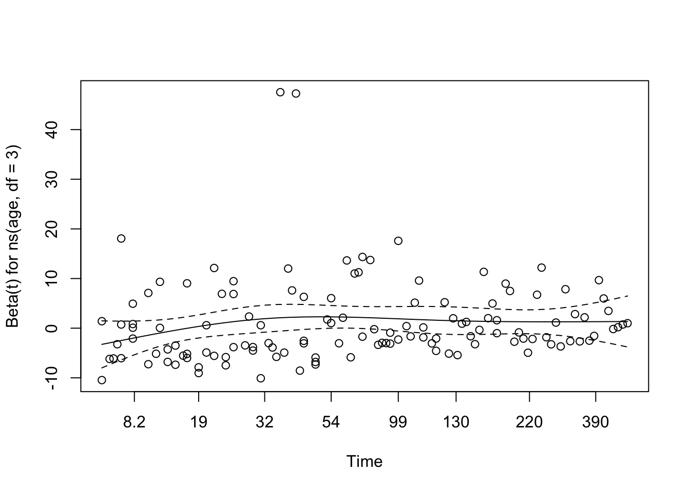{width=672}
:::

::: {.cell-output-display}
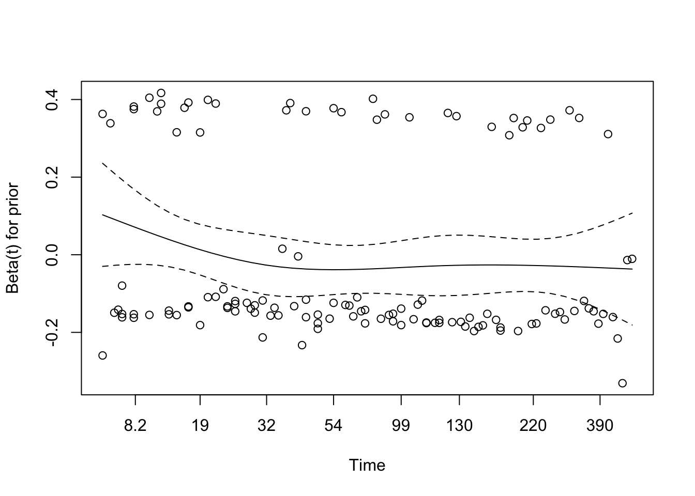{width=672}
:::

::: {.cell-output-display}
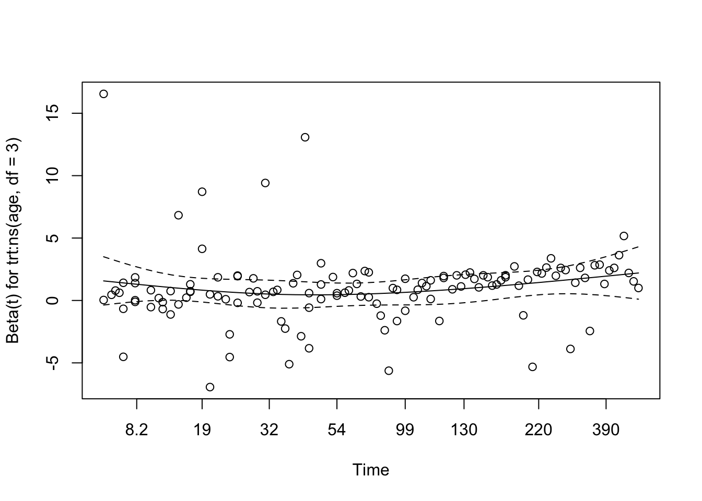{width=672}
:::
:::


The interaction model does not show a clear proportional hazards problem. The
global Schoenfeld test is non-significant (*p* = 0.35), and the residual plots
do not show sustained time trends for the treatment, age, or interaction terms.

**Martingale Residuals for Interaction Model**


::: {.cell}

```{.r .cell-code}
# Residuals vs linear predictor
veteran$martingale_interaction <- residuals(cox_interaction, type = "martingale")
veteran$linear_pred_interaction <- predict(cox_interaction, type = "lp")
ggplot(veteran, aes(x = linear_pred_interaction, y = martingale_interaction, color = trt)) +
  geom_point(alpha = 0.6) +
  geom_hline(yintercept = 0, linetype = "dashed", color = "grey30") +
  theme_minimal(base_size = 13) +
  labs(
    title = "Martingale Residuals vs Linear Predictor\n(Interaction Model)",
    x = "Linear Predictor (Log Hazard)",
    y = "Martingale Residual",
    color = "Treatment Group"
  ) +
  scale_color_manual(values = c("Standard" = "#A569BD", "Experimental" = "#45B39D")) +
  theme(plot.title = element_text(hjust = 0.5, face = "bold"))
```

::: {.cell-output-display}
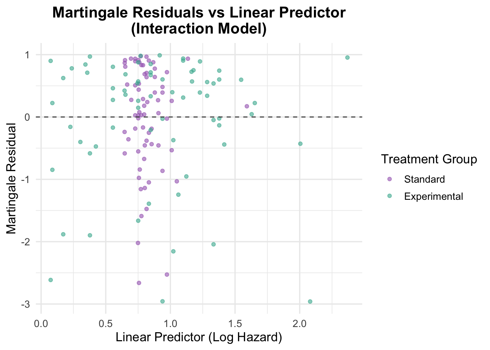{width=672}
:::
:::


The Martingale residuals are scattered without obvious structure, suggesting
that the interaction model is not suffering from major misspecification.

**Deviance Residuals for Interaction Model**


::: {.cell}

```{.r .cell-code}
# Deviance residuals
veteran$deviance_interaction <- residuals(cox_interaction, type = "deviance")
# Plot deviance residuals
ggplot(veteran, aes(x = linear_pred_interaction, y = deviance_interaction, color = trt)) +
  geom_point(position = position_jitter(width = 0.1), alpha = 0.6) + # Adding jitter to avoid overlap
  geom_hline(yintercept = 0, linetype = "dashed", color = "grey30") +
  theme_minimal(base_size = 13) +
  labs(
    title = "Deviance Residuals vs Linear Predictor\n(Interaction Model)",
    x = "Linear Predictor (Log Hazard)",
    y = "Deviance Residual",
    color = "Treatment Group"
  ) +
  scale_color_manual(values = c("Standard" = "#A569BD", "Experimental" = "#45B39D")) +
  theme(plot.title = element_text(hjust = 0.5, face = "bold"))
```

::: {.cell-output-display}
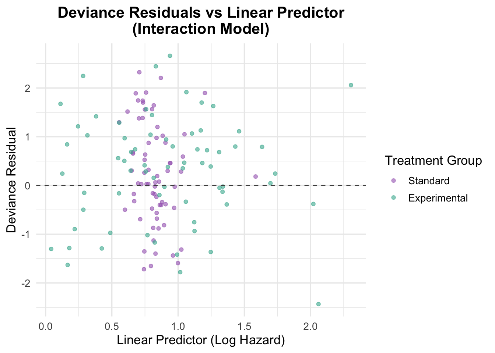{width=672}
:::
:::


The deviance residuals are also broadly reassuring. Residuals are scattered
around zero with no clear trend, suggesting that the interaction model fits the
data reasonably well. That said, the model is more complex than the additive
alternative and does not deliver a clearly better substantive interpretation.

## Interaction of Treatment and Prior Therapy

Prior treatments might alter a patient’s response to new therapies.


::: {.cell}

```{.r .cell-code}
# Fit a cox model with interaction between treatment and prior therapy
cox_interaction_prior <- coxph(Surv(time, status) ~ trt * prior + ns(age, df = 3), data = veteran)
summary(cox_interaction_prior)
```

::: {.cell-output .cell-output-stdout}

```
Call:
coxph(formula = Surv(time, status) ~ trt * prior + ns(age, df = 3), 
    data = veteran)

  n= 137, number of events= 128 

                          coef exp(coef) se(coef)      z Pr(>|z|)
trtExperimental        0.26788   1.30720  0.22118  1.211    0.226
prior                  0.02017   1.02038  0.02739  0.737    0.461
ns(age, df = 3)1      -0.07645   0.92640  0.34494 -0.222    0.825
ns(age, df = 3)2      -1.44497   0.23575  1.00657 -1.436    0.151
ns(age, df = 3)3       0.88992   2.43494  0.61682  1.443    0.149
trtExperimental:prior -0.06206   0.93982  0.04149 -1.496    0.135

                      exp(coef) exp(-coef) lower .95 upper .95
trtExperimental          1.3072     0.7650   0.84736     2.017
prior                    1.0204     0.9800   0.96705     1.077
ns(age, df = 3)1         0.9264     1.0794   0.47118     1.821
ns(age, df = 3)2         0.2358     4.2417   0.03278     1.695
ns(age, df = 3)3         2.4349     0.4107   0.72686     8.157
trtExperimental:prior    0.9398     1.0640   0.86642     1.019

Concordance= 0.561  (se = 0.03 )
Likelihood ratio test= 11.26  on 6 df,   p=0.08
Wald test            = 11.23  on 6 df,   p=0.08
Score (logrank) test = 11.51  on 6 df,   p=0.07
```


:::
:::


A treatment-by-prior-therapy interaction was tested to assess whether previous
treatment modified the effect of the experimental regimen. The interaction term
was not statistically convincing (HR = 0.94, 95% CI: 0.87 to 1.02, *p* = 0.135),
and the model offered only weak evidence of improvement overall.

**Schoenfeld Residuals for Interaction with Prior Therapy**


::: {.cell}

```{.r .cell-code}
# Test proportional hazards assumption for the interaction with prior therapy
cox.zph(cox_interaction_prior)
```

::: {.cell-output .cell-output-stdout}

```
                chisq df     p
trt              2.14  1 0.144
prior            2.71  1 0.100
ns(age, df = 3)  4.63  3 0.201
trt:prior        3.70  1 0.054
GLOBAL           9.04  6 0.171
```


:::
:::


Diagnostics were broadly acceptable. The global Schoenfeld test was
non-significant (*p* = 0.171), and although the interaction term was borderline
(*p* = 0.054), the evidence for time-varying effects is weak.


::: {.cell}

```{.r .cell-code}
# Visual check of Schoenfeld residuals for interaction with prior therapy
plot(cox.zph(cox_interaction_prior))
```

::: {.cell-output-display}
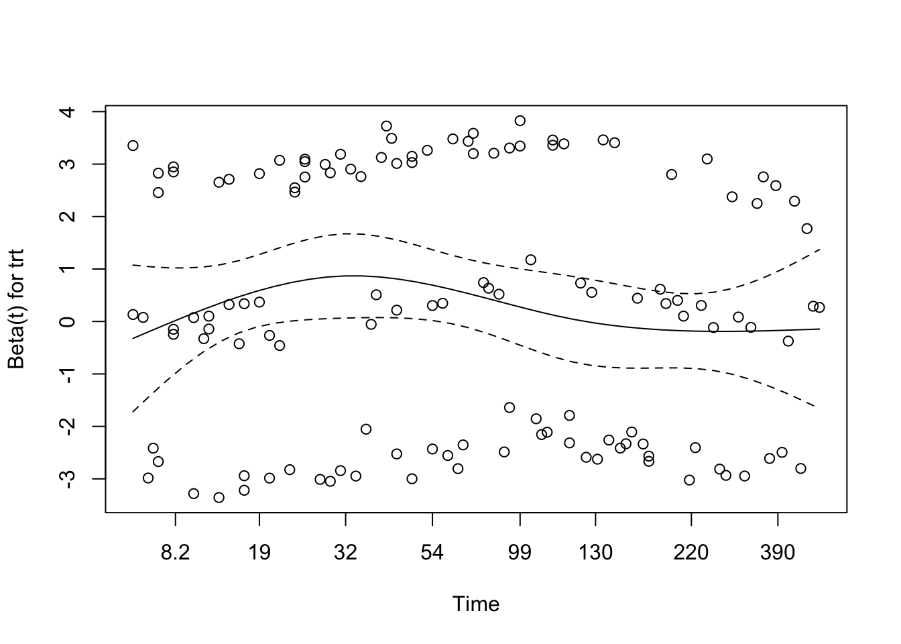{width=672}
:::

::: {.cell-output-display}
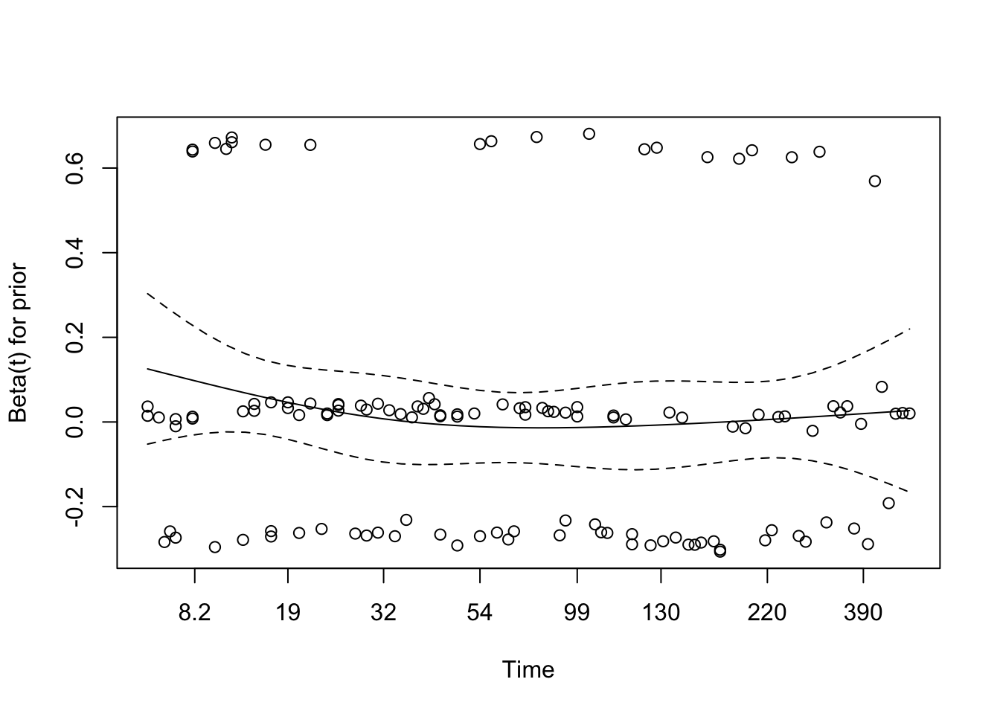{width=672}
:::

::: {.cell-output-display}
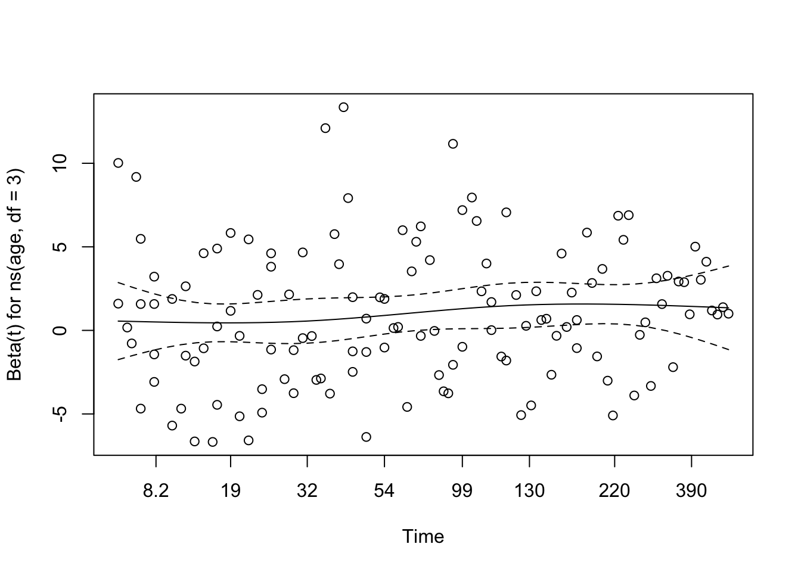{width=672}
:::

::: {.cell-output-display}
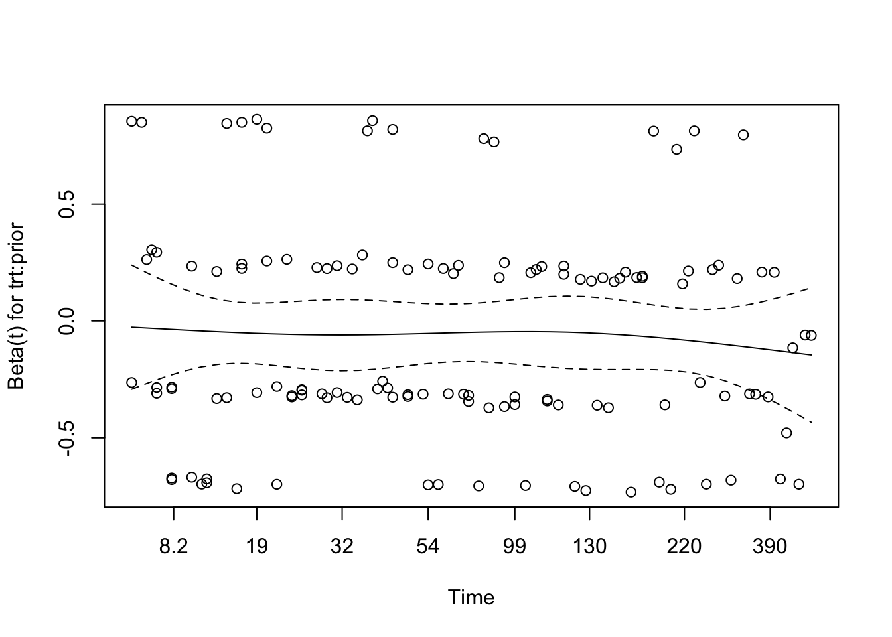{width=672}
:::
:::


The residual plots do not show a clear or systematic time trend, so there is no
strong visual evidence against the proportional hazards assumption for this
interaction model.

**Martingale Residuals for Interaction with Prior Therapy**


::: {.cell}

```{.r .cell-code}
# Residuals vs linear predictor
veteran$martingale_interaction_prior <- residuals(cox_interaction_prior, type = "martingale")
veteran$linear_pred_interaction_prior <- predict(cox_interaction_prior, type = "lp")

ggplot(veteran, aes(x = linear_pred_interaction_prior, y = martingale_interaction_prior, color = trt)) +
  geom_point(alpha = 0.6) +
  geom_hline(yintercept = 0, linetype = "dashed", color = "grey30") +
  theme_minimal(base_size = 13) +
  labs(
    title = "Martingale Residuals vs Linear Predictor\n(Interaction with Prior Therapy)",
    x = "Linear Predictor (Log Hazard)",
    y = "Martingale Residual",
    color = "Treatment Group"
  ) +
  scale_color_manual(values = c("Standard" = "#A569BD", "Experimental" = "#45B39D")) +
  theme(plot.title = element_text(hjust = 0.5, face = "bold"))
```

::: {.cell-output-display}
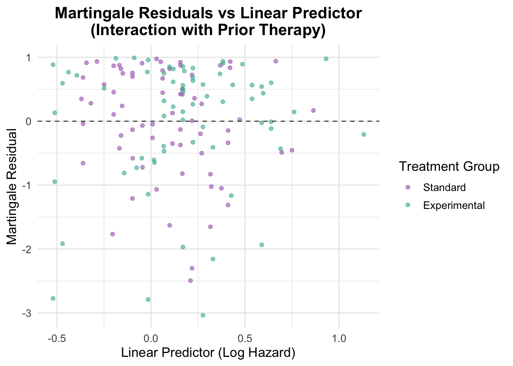{width=672}
:::
:::


The Martingale residuals do not show a strong non-random pattern, which
supports the adequacy of the covariate specification, including the interaction
term. As in earlier models, there is substantial scatter, but no clear sign of
systematic misspecification.

**Deviance Residuals for Interaction with Prior Therapy**


::: {.cell}

```{.r .cell-code}
# Deviance residuals
veteran$deviance_interaction_prior <- residuals(cox_interaction_prior, type = "deviance")

# Plot deviance residuals
ggplot(veteran, aes(x = linear_pred_interaction_prior, y = deviance_interaction_prior, color = trt)) +
  geom_point(position = position_jitter(width = 0.1), alpha = 0.6) + # Adding jitter to avoid overlap
  geom_hline(yintercept = 0, linetype = "dashed", color = "grey30") +
  theme_minimal(base_size = 13) +
  labs(
    title = "Deviance Residuals vs Linear Predictor\n(Interaction with Prior Therapy)",
    x = "Linear Predictor (Log Hazard)",
    y = "Deviance Residual",
    color = "Treatment Group"
  ) +
  scale_color_manual(values = c("Standard" = "#A569BD", "Experimental" = "#45B39D")) +
  theme(plot.title = element_text(hjust = 0.5, face = "bold"))
```

::: {.cell-output-display}
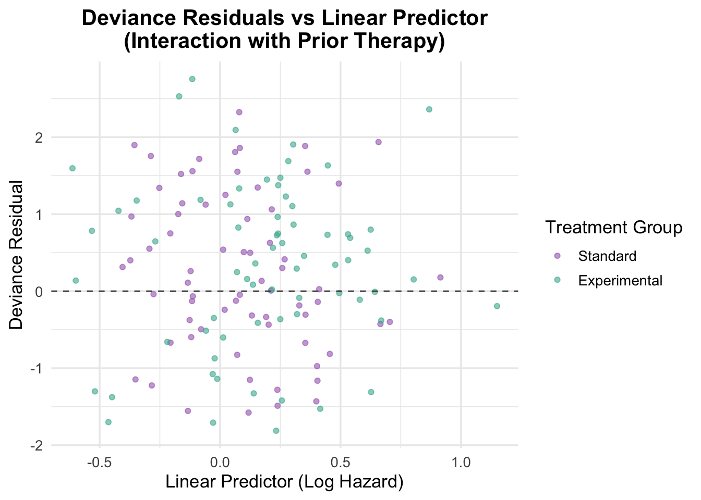{width=672}
:::
:::


The deviance residual plot offers no strong evidence of model misfit. Residuals
are scattered fairly symmetrically around zero, which is consistent with an
adequate fit, but the model still does not add enough value to justify keeping
the interaction.

# Model Comparison: Interaction vs Non-Interaction

Two interaction models were explored: treatment by age and treatment by prior
therapy. The treatment-by-age model showed some signal, but the improvement in
overall fit was modest and did not materially change the interpretation of the
analysis. The treatment-by-prior-therapy interaction was weaker and not
statistically convincing.

Neither interaction improved the model enough to offset the added complexity, so
the additive model was retained as the final specification.

# Final Model Selection and Interpretation

After working through a sequence of Cox proportional hazards models, from
univariable models for each covariate, through multivariable models of
increasing complexity, to interaction models, the final selected model is:

$$\text{trt} + \text{prior} + ns(\text{age}, df=3) + \text{karno} + \text{celltype}$$

**Rationale for Model Selection**

-   **Karnofsky score and cell type** were included on clinical grounds.
    Karnofsky performance score is the dominant prognostic factor in oncology;
    cell type defines biologically distinct lung cancer subtypes with very
    different natural histories. Both were confirmed as strong independent
    predictors in the multivariable model.

-   **Age** was retained and modelled using a natural cubic spline (df = 3)
    following a functional form check that revealed a non-linear relationship
    with the log hazard. A likelihood ratio test confirmed the spline
    specification provided a significantly better fit than a linear age term
    (χ² = 7.91, df = 2, p = 0.019).

-   **Prior therapy** was retained as a standard adjustment covariate in the
    RCT context. It was not statistically significant (HR = 1.01, p = 0.658)
    but its inclusion is clinically justified and does not meaningfully alter
    other estimates.

-   **Interaction terms** (treatment × age, treatment × prior therapy) were
    explored but neither provided a meaningful or significant improvement in
    model fit. Neither was retained in the final model.

-   **`diagtime`** was not included. It was non-significant and its
    interpretation as a predictor is clinically ambiguous in this context.

**Interpretation of the Final Model**

After adjustment for the other covariates, the experimental chemotherapy regimen
was not associated with improved survival relative to standard treatment
(HR = 1.40, 95% CI: 0.94 to 2.09, *p* = 0.097). This is consistent with the
earlier unadjusted comparison.

The strongest predictor in the model is Karnofsky performance score: each
1-point increase is associated with a 3.4% reduction in the hazard of death
(HR = 0.966, 95% CI: 0.955 to 0.977, *p* < 0.001). Tumour cell type is also
important. Relative to squamous cell carcinoma, both small cell carcinoma
(HR = 2.21, *p* = 0.003) and adenocarcinoma (HR = 3.30, *p* < 0.001) are
associated with substantially higher hazard, while large cell carcinoma is not
clearly different from squamous.

Age is better represented non-linearly than with a simple linear term, but its
overall contribution is modest. Prior therapy does not appear to be an
independent predictor of survival in the adjusted model.

**Overall Model Performance**

The final model achieved a concordance index of 0.735, a clear improvement over
the simpler models based only on treatment, age, and prior therapy. Likelihood
ratio, Wald, and score tests were all strongly significant (*p* < 0.001), and
the proportional hazards diagnostics did not indicate a major assumption
problem.

# Conclusion

This analysis examined survival in 137 male veterans with advanced,
inoperable lung cancer enrolled in a randomised trial of standard versus
experimental chemotherapy. Across a sequence of Cox models, the main finding was
consistent: the experimental treatment did not improve survival.

The clearest predictors of outcome were baseline functional status and tumour
cell type. Higher Karnofsky scores were associated with lower hazard, while
adenocarcinoma and small cell carcinoma were associated with worse prognosis
than squamous cell carcinoma. Age showed some evidence of a non-linear
association with hazard, but its contribution was modest, and prior therapy was
not independently informative.

Overall, the final model performed well enough to capture meaningful risk
differences in the cohort, while remaining interpretable and diagnostically
sound.

# Limitations

**Sample size and generalisability.** The dataset comprises 137 patients from
a single trial, which constrains statistical power for detecting modest
treatment effects and limits the precision of subgroup estimates. The small
cell carcinoma and adenocarcinoma groups in particular have relatively few
patients, making their hazard ratio estimates less stable.

**All-male cohort.** All participants were male veterans. Lung cancer biology,
treatment response, and prognosis differ between sexes, so findings cannot be
assumed to generalise to female patients.

**Historical data.** The trial was conducted in the 1970s and 1980s. Neither the
experimental treatment nor the standard regimen reflects current clinical
practice, and the trial predates targeted therapy, immunotherapy, and modern
platinum-based regimens.

**Event rate and censoring.** With 128 deaths among 137 patients (93.4%),
this dataset has very limited censoring. Survival estimates at longer time
points are based on very few at-risk individuals.

**No external validation.** Model performance (concordance = 0.735) was
assessed on the same data used to fit the model. Without an independent
validation cohort, this estimate is likely optimistic.

**Residual confounding.** Unmeasured factors such as comorbidities, disease
stage, smoking history, or treatment compliance may confound the observed
associations.

**Interaction exploration was limited.** Only two interaction terms were
tested. Clinically meaningful interactions between other covariates (e.g.,
treatment × cell type) were not explored.

